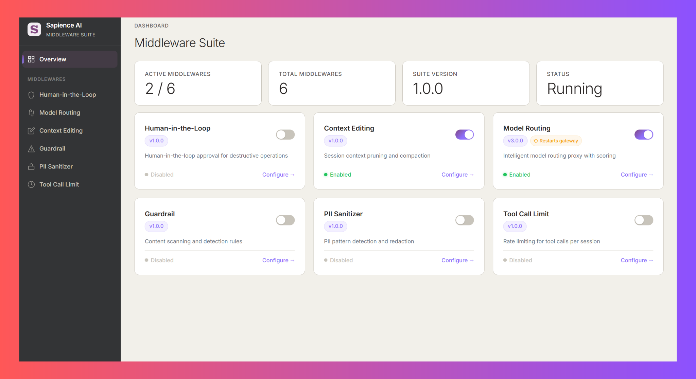

<div align="center">
  <br />
  
  <br />
  <br />

  <h1>Sapience AI Middleware Suite</h1>

  <h3>
    The orchestration layer between 🦞 <b>OpenClaw</b> and everything it touches.
  </h3>

  <p>Six middlewares that govern, optimize, and observe every turn and every tool call.</p>

  <br />

  <p>
    <a href="https://github.com/Sapience-AI-Discovery-Team/Openclaw-Middleware-Suite/actions/workflows/ci.yml"></a>
    <a href="https://github.com/Sapience-AI-Discovery-Team/Openclaw-Middleware-Suite/actions/workflows/ci.yml"></a>
    <a href="https://github.com/Sapience-AI-Discovery-Team/Openclaw-Middleware-Suite/stargazers"></a>
    <a href="LICENSE"></a>
    <a href="http://www.typescriptlang.org/"></a>
    
  </p>

  <p>
    <a href="#quickstart">Quickstart</a> &nbsp;&bull;&nbsp;
    <a href="#the-middlewares">Middlewares</a> &nbsp;&bull;&nbsp;
    <a href="#dashboard">Dashboard</a> &nbsp;&bull;&nbsp;
    <a href="#configuration-reference">Config</a> &nbsp;&bull;&nbsp;
    <a href="#api-reference">API</a> &nbsp;&bull;&nbsp;
    <a href="#contributing">Contributing</a>
  </p>

  <br />
</div>

---

## The Problem

A single OpenClaw session can read your codebase, run arbitrary shell commands, manage your Google Drive, send emails on your behalf, and push code to production — all autonomously. And every turn along the way spends tokens, picks a model, and accumulates context.

Today there is no layer between _"the agent decided to do something"_ and _"it happened."_ That gap hides three distinct problems — and they rarely share a solution:

- **Safety gaps.** Sandboxing stops the agent from escaping its container. Inside that container, it still holds the keys to the kingdom: API tokens, file system access, outbound network, email credentials. One hallucinated `rm -rf`, one prompt injection buried in a fetched document, one leaked SSN in a tool argument — and you're dealing with real damage.
- **Runaway cost.** Every turn re-sends the full context window. Every request picks whatever model was wired in, whether the task needs it or not. A long coding session on a frontier model can burn through dollars in minutes, most of it spent re-reading stale history at premium rates.
- **Degrading context.** As sessions grow, the agent loses its earliest instructions, forgets key decisions, and starts contradicting itself. Naive truncation throws away what matters; doing nothing blows the budget.

**That's what this suite is for.**

Sapience AI acts as the control plane for OpenClaw and orchestrates every turn and every tool call. Six middlewares — each solving a distinct failure mode — work together in a single pipeline: four **govern and protect** the action surface (HITL, Guardrail, PII Sanitizer, Tool Call Limits), while two **optimize the request itself** (Context Editing compacts history, Model Routing picks the right model for the job).

---

<h2 id="the-middlewares">The Middlewares</h2>

> Jump to the one you need.

| # | Middleware | What It Does |
|:-:|---|---|
| 1 | [:shield: **HITL**](#hitl) | Human approval for dangerous actions |
| 2 | [:brain: **Context Editing**](#context-editing) | Intelligent context window compaction |
| 3 | [:zap: **Model Routing**](#model-routing) | Route requests to the right model & provider |
| 4 | [:lock: **Guardrail**](#guardrail) | Block prompt injection, exfiltration, destructive commands |
| 5 | [:detective: **PII Sanitizer**](#pii-sanitizer) | Detect & redact personally identifiable information |
| 6 | [:bar_chart: **Tool Call Limit**](#tool-call-limit) | Enforce session & request budgets per tool |

---

<h2 id="quickstart">Quickstart</h2>

Get the full suite running in under 5 minutes.

### 1. Install

```bash
# From npm (published plugin)
openclaw plugins install sapience-ai-suite@beta

# Or from source
git clone https://github.com/Sapience-AI-Discovery-Team/Openclaw-Middleware-Suite.git
cd Openclaw-Middleware-Suite
npm install && npm run build
openclaw plugins install --link .
```

### 2. Configure

```bash
# Interactive wizard — walks you through security level, modules, and policies
sai init

# Start the gateway — dashboard served at http://localhost:9000/dashboard
openclaw gateway start
```

---

<a id="hitl"></a>

## :shield: Human-in-the-Loop (HITL)

> **The last line of defense.** Every action your agent takes is evaluated against a security policy. Dangerous actions require explicit human approval before they execute.

### Why It Exists

AI agents make mistakes. They hallucinate file paths, misinterpret instructions, and occasionally try to do things that would be catastrophic in production. HITL ensures that a human reviews high-risk actions before they happen — not after.

### How It Works

```
Tool Call Arrives
  │
  ├─ Policy Lookup ─── ALLOW ──→ Execute immediately
  │
  ├─ Policy Lookup ─── DENY ───→ Block with reason
  │
  └─ Policy Lookup ─── ASK ────→ Risk Assessment
                                    │
                                    ├─ Destructive classifier
                                    ├─ Irreversibility scorer (0-100)
                                    └─ Memory risk forecaster
                                    │
                                    ▼
                                 Approval Queue
                                    │
                                    ├─ /approve ──→ Execute
                                    ├─ /approve <TOTP> ──→ Execute (MFA verified)
                                    └─ /deny ──→ Block
```

### Features — vs. ClawReins

[ClawReins](https://github.com/pegasi-ai/reins) is the closest comparable HITL layer for OpenClaw. The two share a common foundation — three-decision policies, irreversibility scoring, destructive command detection, and a WhatsApp/Telegram approval channel. Sapience HITL extends that foundation in two places that matter most: **a broader set of protected tools, and an approval mechanism the agent can't bypass.**

**Legend:** ✅ supported &nbsp;·&nbsp; ❌ not present

| Feature                                                                                                           |             ClawReins             |        Sapience HITL         |
| ----------------------------------------------------------------------------------------------------------------- | :-------------------------------: | :--------------------------: |
| **Policy model** — `ALLOW` / `DENY` / `ASK` per module & method, with `allowPaths` / `denyPaths` globs            |                ✅                 |              ✅              |
| **Risk scoring** — irreversibility (0–100), destructive classifier (`HIGH` / `CATASTROPHIC`), trajectory forecast |                ✅                 |              ✅              |
| **Approval queue** — async WhatsApp/Telegram + TTY with TTL expiry & trust rate limiting                          |                ✅                 |              ✅              |
| **Immutable audit trail** — append-only JSONL with full risk scores per decision                                  |                ✅                 |              ✅              |
| **Catastrophic-action confirmation**                                                                              |  On-screen `CONFIRM-XXXX` token   |   **TOTP 2FA** (RFC 6238)    |
| **Agent cannot read the approval code** (self-approval prevention)                                                | ❌ token appears in terminal/chat | ✅ code generated off-device |
| **ArgsHash enforcement on retry** (prevents param substitution)                                                   |          ❌ logged only           |   ✅ verified on approval    |
| Protects FileSystem, Shell, Browser, Network, Gateway                                                             |                ✅                 |              ✅              |
| **Gmail** (list, send, draft, delete)                                                                             |                ❌                 |              ✅              |
| **GoogleDrive** (list, upload, download, delete, share, move)                                                     |                ❌                 |              ✅              |
| **Memory** (search, add, delete)                                                                                  |                ❌                 |              ✅              |
| **Process** (list, poll, log, write, kill, clear, remove)                                                         |                ❌                 |              ✅              |
| **Shell subcommand routing** (`gog`, `gdrive`, `rclone` → Gmail/Drive policy)                                     |                ❌                 |              ✅              |
| **Gateway endpoint reclassification** (`gateway.maton.ai/*` auto-mapped)                                          |                ❌                 |              ✅              |
| **MCP tool name mapping** (`mcp__google_workspace__*`)                                                            |                ❌                 |              ✅              |

Any unmapped tool falls through to `defaultAction` (ASK).

### CLI

```bash
sai hitl policy           # View/manage security policies
sai hitl stats            # View approval statistics
sai hitl audit            # View decision audit trail
sai hitl reset            # Reset statistics
```

---

<a id="context-editing"></a>

## :brain: Context Editing

> **Intelligent context window compaction.** Long sessions don't lose critical context — the middleware automatically compresses old messages while preserving what matters.

### Why It Exists

LLM context windows are finite — and expensive. Every token in the context window costs money on every single request. As a session grows, you're paying to re-read thousands of tokens of stale conversation history that the agent no longer needs. A 120K-token session hitting GPT-4 on every turn can burn through dollars in minutes, most of it on context the model is barely using.

And it's not just cost. In long coding sessions, the agent gradually loses its earliest instructions, forgets key decisions, and starts contradicting itself as critical context gets pushed out by noise. Naive truncation throws away important context indiscriminately.

Context Editing solves both problems: it compresses old messages using LLM-powered extraction (ICC), keeping token counts — and costs — under control while preserving the context that actually matters.

### How It Works

```
Turn Completes
  │
  └─ agent_end hook ──→ Evaluate triggers
                           │
                           ├─ Token count > threshold?
                           ├─ Message count > threshold?
                           └─ Adaptive rules?
                           │
                           ▼
                        Schedule compaction (if triggered)

Next Turn Begins
  │
  └─ before_agent_start hook ──→ Compact
                                   │
                                   ├─ Run ICC extraction
                                   │    ├─ Priority Preservation
                                   │    ├─ Conflict Resolution
                                   │    └─ Entity Locks
                                   │
                                   ▼
                                Replace old messages with dense summary
                                (before SessionManager opens the JSONL)
```

The two-phase design ensures compaction happens *before* SessionManager opens the JSONL file, preventing race conditions.

### ICC Pipeline (Intelligent Context Compression)

| Stage                     | What It Extracts                                                |
| ------------------------- | --------------------------------------------------------------- |
| **Priority Preservation** | Critical objectives and instructions the agent must not forget  |
| **Conflict Resolution**   | Contradictions in the transcript are detected and resolved      |
| **Entity Locks**          | Key values (names, paths, config values) are preserved verbatim |

### Features — vs. OpenClaw's Built-in Compaction

OpenClaw already ships a robust compaction pipeline: when a prompt would overflow the context window, it splits the transcript into chunks, summarizes each one, then merges the partials — a bulk summarizer built to survive oversized tool outputs, tool-call pairing constraints, and transient API failures. Sapience Context Editing **does not replace that pipeline — it adds a cheaper, steerable fast path on top of it.**

The fast path is a **single LLM call** whose output (the ICC extraction: entities, conflicts, priorities) _is_ the compaction summary. One call means the prompt can be user-steered, the model can be swapped, and compaction can fire early on your own thresholds instead of waiting for overflow. If the ICC call ever fails — for example, on a transcript too large for the extraction model's window — the middleware simply skips that turn and OpenClaw's native overflow-triggered compaction handles it on the next prompt exactly as it would for a vanilla install. You never lose coverage; you just lose the steering on the overflow edge case.

**Legend:** ✅ supported &nbsp;·&nbsp; ❌ not present

| Feature                                                                                                        |     OpenClaw built-in      |         Sapience Context Editing         |
| -------------------------------------------------------------------------------------------------------------- | :------------------------: | :--------------------------------------: |
| **Compaction pipeline** — summarize old messages into a dense summary                                          | ✅ two-stage chunk + merge |    ✅ single ICC call as the summary     |
| **Overflow-triggered compaction** (fires when next prompt exceeds context window)                              |             ✅             |                    ✅                    |
| **Manual `/compact` command**                                                                                  |             ✅             |                    ✅                    |
| **Identifier preservation** — UUIDs, hashes, URLs, file names kept verbatim                                    |             ✅             |                    ✅                    |
| **Early / proactive compaction** before hitting the context limit                                              |      ❌ reactive only      |          ✅ threshold-triggered          |
| **Token-count threshold** for early compaction (default 80k, configurable)                                     |             ❌             |                    ✅                    |
| **Message-count threshold** for early compaction (default 50, configurable)                                    |             ❌             |                    ✅                    |
| **Trigger mode selector** — `token` / `message` / `both`                                                       |             ❌             |                    ✅                    |
| **Keep N recent messages verbatim** before the compaction cut                                                  |    ❌ fixed chunk ratio    |           ✅ user-configurable           |
| **Keep N recent tokens verbatim** before the compaction cut                                                    |   ❌ internal knob only    |           ✅ user-configurable           |
| **Custom compaction prompt** — user-supplied instructions steer what the summary preserves                     |   ❌ fixed merge prompt    |    ✅ injected on the single ICC call    |
| **Typed Entity Locks** — API endpoints, file paths, variables, constants, model names, code identifiers        |             ❌             |                    ✅                    |
| **Conflict Resolution** — detects instruction overrides ("use X instead of Y") and locks the resolved value    |             ❌             |                    ✅                    |
| **Priority Preservation** — `TODO` / `FIXME` / `REQUIREMENT` / `MUST` segments flagged for verbatim carry-over |             ❌             |                    ✅                    |
| **Custom compaction model** — run summarization on a different model than the agent                            | ➕ raw `openclaw.json` key | ✅ first-class via `sai ctx model --set` |
| **Session pruning toggle** (cache-TTL for idle contexts)                                                       | ➕ raw `openclaw.json` key |   ✅ first-class via `sai ctx pruning`   |
| **Interactive wizard** for all of the above                                                                    |             ❌             |              ✅ `sai init`               |
| **Per-compaction audit trail** (JSONL: entities, conflicts, priorities, instruction hash)                      |             ❌             |                    ✅                    |
| **Per-session cumulative token-savings stats**                                                                 |             ❌             |                    ✅                    |

### CLI

```bash
sai ctx status    # View compaction state
sai ctx stats     # Token savings and compaction history
sai ctx reset     # Clear compaction state
```

---

<a id="model-routing"></a>

## :zap: Model Routing

> **Route every request to the right model.** Simple tasks go to fast, cheap models. Complex reasoning goes to the best. Automatic fallbacks, multi-provider support, and real-time cost tracking.

### Why It Exists

Not every request needs GPT-4 or Claude Opus. A simple "list files in this directory" doesn't need a $0.015/1K-token model — but without routing, that's what it gets. Model Routing scores request complexity in real time and routes to the optimal model tier, cutting costs by up to 70% without sacrificing quality where it matters.

### How It Works

```
Incoming Request
  │
  ├─ Complexity Scorer
  │    ├─ Message length
  │    ├─ Instruction complexity
  │    ├─ Tool usage patterns
  │    └─ Reasoning depth signals
  │
  ├─ Tier Assignment ──→ simple | standard | complex | reasoning
  │
  ├─ Model Selection ──→ Primary model for tier
  │    └─ Fallback chain if primary fails
  │
  └─ Provider Routing ──→ Route to correct API endpoint
       ├─ OpenAI format
       ├─ Anthropic format
       └─ Google format
```

### Tier System

| Tier          | Use Case                                   | Example Models             |
| ------------- | ------------------------------------------ | -------------------------- |
| **Simple**    | File reads, listing, basic Q&A             | GPT-4o-mini, Claude Haiku  |
| **Standard**  | Code generation, moderate reasoning        | GPT-4o, Claude Sonnet      |
| **Complex**   | Architecture decisions, complex refactors  | GPT-4, Claude Opus         |
| **Reasoning** | Multi-step planning, novel problem solving | o1, Claude Opus (extended) |

### Features — vs. Manifest

[Manifest](https://github.com/mnfst/manifest) is the closest comparable complexity-based model router — both share the same 23-dimension scoring core derived from the same lineage. The two target different deployment models: Manifest ships as a Docker service with a multi-tenant web dashboard and Postgres backend; Sapience Model Routing is an OpenClaw plugin running on the developer's machine with a local JSON config and CLI. The table below focuses on what Sapience adds on top of the shared scoring foundation — in particular **per-session model pinning** and **auto prompt-cache marker injection**, which compound to keep the provider's cached prefix warm across every turn of a pinned session.

**Legend:** ✅ supported &nbsp;·&nbsp; ❌ not present

| Feature                                                                                                                                                          |                        Manifest                        |                                Sapience Model Routing                                 |
| ---------------------------------------------------------------------------------------------------------------------------------------------------------------- | :----------------------------------------------------: | :-----------------------------------------------------------------------------------: |
| **23-dimension scorer** — Aho-Corasick trie, density clustering, sigmoid (k=8) with 0.45 ambiguity threshold, four-tier boundaries                               |                       ✅ parity                        |                                       ✅ parity                                       |
| **Session momentum** — length-weighted blend of the last 5 tier decisions                                                                                        |                           ✅                           |                                          ✅                                           |
| **Request deduplication** — concurrent retries / double-clicks share one upstream call (30s window)                                                              |               ✅ trace-id / token-based                |                            ✅ SHA-256 inflight + completed                            |
| **Capability-filtered fallback chain** — filters by tool support, vision, context window, exclusions                                                             |                           ✅                           |                                   ✅ max 5 per tier                                   |
| **Native provider adapters** — OpenAI / Anthropic / Google with SSE streaming conversion                                                                         |           ✅ (+ ChatGPT Codex subscription)            |                                          ✅                                           |
| **Hard overrides** — reasoning keyword, short-message, tool-floor, large-context                                                                                 |                     ✅ 4 overrides                     | ✅ 6 overrides (+ structured-output floor + session-startup `/new` `/reset` → SIMPLE) |
| **Multilingual keywords** — 9 languages, 1,500+ keywords across all 14 keyword dimensions                                                                        |                    ❌ English only                     |                                          ✅                                           |
| **Routing profiles** — `auto` / `eco` / `premium` / `agentic` switch the whole fallback chain in one setting                                                     |              ❌ single deterministic map               |                                          ✅                                           |
| **Model pinning** — the same session keeps the same model across every turn, with auto-release on complexity escalation                                          |                 ❌ tier-only momentum                  |                            ✅ per-session high-water mark                             |
| **Three-strike escalation** — user retries an identical request 3× → auto-bump to next tier                                                                      |                           ❌                           |                                          ✅                                           |
| **Auto cache-marker injection** — Anthropic `cache_control` on last system block + last tool, Google `cachedContent` token passthrough                           |                   ✅ Anthropic only                    |                                 ✅ Anthropic + Google                                 |
| **Session-pinned prompt caching** — pinning + injection compound so the provider's cached prefix survives across turns (up to 90% off cached input on Anthropic) | ❌ no pinning → prefix drops whenever the model drifts |                                          ✅                                           |
| **Deterministic response cache** — LRU for `temperature=0` non-streaming requests (bypasses the provider entirely on repeat identical prompts)                   |                           ❌                           |                            ✅ opt-in, 200 entries / 10 min                            |
| **Daily cost alerts** — warn / critical thresholds that fire once per day on top of a 90-day ledger                                                              |         ❌ notifications exist, no budget caps         |                     ✅ `$5` warn / `$20` critical (configurable)                      |
| **Per-step audit log** — request-id-scoped JSONL trace of every routing decision                                                                                 |             Postgres `agent_message` rows              |                                    ✅ local JSONL                                     |
| **Config hot-reload** (`sapience-ai-suite.json`)                                                                                                                 |                  ❌ restart required                   |                            ✅ `fs.watchFile`, 2s debounce                             |
| **Plugin hook system** — `onBeforeScore` / `onAfterScore` / `onBeforeForward` / `onAfterForward`                                                                 |                           ❌                           |                                      ✅ 4 hooks                                       |
| **Full CLI** — `sai router stats / config / tiers / test / exclude / models / reset`                                                                             |                           ❌                           |                                          ✅                                           |
| **Interactive setup wizard** — profile + tier customization + port + live catalog pull                                                                           |                  Web dashboard signup                  |                                     ✅ `sai init`                                     |
| **Specificity routing** — task-type categories (coding / vision / trading / …) override complexity tier                                                          |                    ✅ 9 categories                     |                                          ❌                                           |
| **Subscription OAuth** — ChatGPT Plus, Claude Max, MiniMax, GitHub Copilot                                                                                       |                           ✅                           |                                   ❌ API keys only                                    |

### CLI

```bash
sai router stats       # Daily cost ledger + per-model breakdown + alerts
sai router config      # View / edit profile, thresholds, exclusions
sai router tiers       # Inspect tier-to-model assignments
sai router models      # Sync live model catalog (LiteLLM, 24h cache)
sai router test        # Score a sample request without forwarding
sai router reset       # Reset cost history / session state
```

> **Note:** Toggling Model Routing on/off requires a gateway restart. The dashboard handles this automatically with a reconnection overlay.

---

<a id="guardrail"></a>

## :lock: Guardrail

> **Multi-layer defense against prompt injection, data exfiltration, and destructive commands.** Scans both input and output surfaces with regex, heuristic, and entropy-based detection.

### Why It Exists

Prompt injection is the #1 attack vector against AI agents. A single malicious instruction hidden in a document, email, or web page can hijack your agent's behavior — making it exfiltrate secrets, delete data, or execute arbitrary commands. Guardrail catches these attacks at multiple detection layers before they can cause harm.

### Detection Layers

| Layer                  | Technique              | What It Catches                                |
| ---------------------- | ---------------------- | ---------------------------------------------- |
| **Regex Scanner**      | Pattern matching       | Known injection patterns, role overrides       |
| **Prefix Scanner**     | Known-prefix detection | Common injection prefixes and escape sequences |
| **Heuristic Scanner**  | Behavioral analysis    | Unusual request patterns, multi-step attacks   |
| **Entropy Analyzer**   | Randomness detection   | Encoded payloads, obfuscated data exfiltration |
| **Unicode Normalizer** | Canonicalization       | Unicode escape attacks, homoglyph substitution |
| **OpenAI Moderation API** | ML content classifier (external) | Violence, hate, sexual, self-harm, illicit content — result cached at `before_agent_start`, severity-tiered enforcement at `before_message_write` (default: rewrite on `HIGH` + `CRITICAL`; `MEDIUM` is audit-only) |

### Guard Modules

| Guard                    | What It Protects                                                 |
| ------------------------ | ---------------------------------------------------------------- |
| **Sensitive Paths**      | Blocks access to `~/.ssh`, `~/.aws`, `/etc/passwd`, `.env` files |
| **Egress Control**       | Prevents unauthorized data transmission to external endpoints    |
| **Destructive Commands** | Catches `rm -rf`, `DROP TABLE`, `kill -9`, and similar patterns  |
| **Content Moderation**   | OpenAI Moderation API check on incoming prompts — flags violence, hate, sexual, self-harm, illicit content (async → sync cache bridge; severity-tiered via `moderation.rewriteThreshold`, default `HIGH`) |
| **Role Impersonation**   | Detects attempts to masquerade as system/admin roles             |
| **Canary Tracker**       | Honeypot tokens that trigger alerts if exposed in output         |
| **Output Scrubber**      | Removes middleware metadata from agent responses                 |

### Key Features

- **Input + output scanning** — Covers both prompt injection and data leakage
- **Configurable actions** — `BLOCK`, `WARN`, `REDACT` per rule
- **Confidence filtering** — Adjustable sensitivity to reduce false positives
- **Dry-run mode** — Log detections without blocking (for tuning)
- **Custom patterns** — Add your own regex rules for domain-specific threats

### Features — vs. OpenClaw Shield & OpenGuardrails

The two closest comparables are [**OpenClaw Shield**](https://github.com/knostic/openclaw-shield) (Knostic) — a lightweight OpenClaw plugin with five independently-toggleable policy layers, including an advisory "security gate" tool that relies on the agent obeying injected instructions — and [**OpenGuardrails / MoltGuard**](https://github.com/OpenGuardrails) — a full-stack platform with an agent-side plugin talking to a hosted Core service that runs a 10-scanner content model and a behavioral rule engine over tool-call sequences. Sapience Guardrail takes a different stance from both: **everything runs in-process on OpenClaw's native hooks**, and the `before_message_write` hook **actually rewrites the persisted transcript** so the LLM can never see the pre-redacted content — not just on the next turn, but on the current one. The rows below focus on the capabilities that actually differ; shared basics (regex scanning, OpenClaw plugin integration, PII redaction) are omitted.

**Legend:** ✅ supported &nbsp;·&nbsp; ⚠️ partial &nbsp;·&nbsp; ❌ not present

| Feature                                                                                                            |  OpenClaw Shield  |      OpenGuardrails       |                               Sapience Guardrail                               |
| ------------------------------------------------------------------------------------------------------------------ | :---------------: | :-----------------------: | :----------------------------------------------------------------------------: |
| **Prompt injection regex / pattern scanner**                                                                       |        ✅         |   ✅ (hosted Core S01)    |                                ✅ (18 patterns)                                |
| **Heuristic / Shannon-entropy detector** for obfuscated payloads                                                   |        ❌         |            ❌             |                         ✅ (≥ 4.0 on 20+ char tokens)                          |
| **Unicode NFKC normalization** before scan — homoglyph + zero-width + soft hyphen                                  |        ❌         |            ❌             |                                       ✅                                       |
| **External moderation API integration** (OpenAI Moderation, Perspective, …)                                        |        ❌         | ⚠️ gateway sanitizer only |                ✅ OpenAI Moderation, async → sync cache bridge                 |
| **Sensitive file path blocking** (`.ssh`, `.env`, `.aws/credentials`, …)                                           |  ✅ 18 patterns   |            ❌             |                      ✅ 49 patterns + symlink resolution                       |
| **Outbound domain allowlist** (default-deny)                                                                       |        ❌         |            ❌             |              ✅ 25 allowed (npm, PyPI, GitHub, AWS, Cloudflare…)               |
| **Private-IP / metadata-endpoint SSRF block** (`169.254.169.254`, RFC 1918, IPv6 ULA, mapped `::ffff:`)            |        ❌         |            ❌             |                                       ✅                                       |
| **Destructive shell command blocking** (`rm -rf`, `DROP TABLE`, `git push --force main`, fork bombs, `chmod 777`…) |   ✅ 6 patterns   |   ❌ (behavioral only)    |                         ✅ 21 built-in + custom regex                          |
| **Role-impersonation / ChatML / fake `[SYSTEM]` neutralization**                                                   |        ❌         |            ❌             |             ✅ 17 patterns incl. Llama markers & tool-output tags              |
| **Canary / leakback re-redaction** (re-detect previously-redacted content)                                         |        ❌         |            ❌             |                 ✅ SHA-256 ring buffer, whitespace-normalized                  |
| **Actual message rewrite that persists to transcript** (vs log-only or post-persist redaction)                     |        ❌         |            ❌             | ✅ `before_message_write` returns `{ message }` per OpenClaw 2026.4.x contract |
| **Async → sync cache bridge** — external API check in `before_agent_start`, severity-tiered rewrite in sync `before_message_write` (configurable threshold) |        ❌         |            ❌             |                                       ✅                                       |
| **Behavioral rule engine over tool-call sequences** (e.g. file read → external write)                              |        ❌         |      ✅ hosted Core       |                                       ❌                                       |
| **Advisory "security gate" LLM-policy tool** the agent is prompted to call                                         |       ✅ L5       |            ❌             |                                       ❌                                       |
| **Dry-run / shadow mode** (log without blocking)                                                                   |        ✅         |        ⚠️ unclear         |                                       ✅                                       |
| **Per-decision JSONL audit log** — timestamp, module, severity, sessionKey, agentId                                |        ❌         |      ✅ (hosted DB)       |                              ✅ local append-only                              |
| **Full CLI surface** for runtime config                                                                            | ❌ JSON edit only | ✅ `/og_*` slash commands |                              ✅ `sai guardrail …`                              |
| **Web dashboard**                                                                                                  |        ❌         |    ✅ localhost:53668     |                                  ❌ (planned)                                  |
| **Runs fully in-process** (no external service dependency)                                                         |        ✅         |   ❌ requires Core API    |                                       ✅                                       |
| **Multi-tenant managed service** with billing / quotas                                                             |        ❌         |            ✅             |                                       ❌                                       |

**What's genuinely unique to each**

- **OpenClaw Shield** — per-layer toggles (L1–L5) so you can ship a degraded config when a host lacks a given hook; advisory L5 gate relies on the agent obeying injected policy rather than host enforcement.
- **OpenGuardrails / MoltGuard** — hosted behavioral rule engine that catches multi-turn attack patterns (credential read → network write), a 10-scanner content model spanning NSFW / MCP poisoning / off-topic drift, and a managed dashboard with a quota system.
- **Sapience Guardrail** — synchronous transcript rewrite so the LLM never sees pre-redacted content; Unicode NFKC + homoglyph + zero-width normalization pre-scan; entropy-based obfuscation detection; full-depth L2 stack (sensitive-paths + egress allowlist + private-IP SSRF + destructive commands) firing before any tool executes; confidence-filtered matching to suppress rephrasing false positives.

### What We Adopted From Each

Sapience Guardrail did not emerge in a vacuum. Both comparables contributed foundational ideas we built on — we name them explicitly below.

| Capability | OpenGuardrails | OpenClaw Shield | Sapience Guardrail |
|---|:-:|:-:|:-:|
| **Regex rule engine with category taxonomy** (injection / PII / suspicious) | Adopted from | — | Extended: 50 rules across 3 engines (regex + prefix + heuristic) |
| **Confidence tiers** (HIGH / MEDIUM / LOW) | Adopted from | — | Extended: cross-category *and* same-category multi-match required for MEDIUM |
| **L2 tool-call interception** via `before_tool_call` hook | — | Adopted from | Extended: 6 guards (sensitive-paths, egress, destructive, shell-indirection, pre-read, param scan) |
| **File path blocklist** concept | — | Adopted from | Extended: 49 patterns + allowlist overrides + symlink resolution |
| **L3 transcript scanning** via `before_message_write` | — | — | Original — closes the gap Shield left open (tool results, file content entering *after* execution) |
| **L1 prompt-guard policy injection** into system prompt | — | — | Original — agent learns *what* is protected, never *how* |
| **Egress / SSRF prevention** (domain allowlist, IPv4+IPv6 private ranges, `169.254.169.254`) | — | — | Original |
| **Canary tracking / leakback re-redaction** (SHA-256 ring buffer) | — | — | Original |
| **Role impersonation** (ChatML, Llama, fake `[SYSTEM]`, tool-output tag injection — 17 patterns) | — | — | Original |
| **Agent interrogation defense** (defense-enumeration detection) | — | — | Original |
| **OpenAI Moderation API integration** with async → sync cache bridge | — | — | Original |
| **CLI management surface** (`sai guardrail …`) | — | — | Original |

**The one thing neither comparable does:** combine pre-execution interception *with* post-execution transcript scanning. OpenGuardrails scans text but can't block tools. OpenClaw Shield blocks tools but can't scan transcripts. Sapience does both in the same pipeline.

### Configuration

```json
{
  "enabled": true,
  "dryRunMode": false,
  "entropyThreshold": 4.0,
  "sensitivePaths": { "enabled": true, "action": "BLOCK" },
  "egressControl": { "enabled": true, "blockDataSending": true },
  "destructiveCommands": { "enabled": true, "action": "BLOCK" },
  "moderation": { "rewriteThreshold": "HIGH" }
}
```

`moderation.rewriteThreshold` controls the severity bar for the async → sync cache bridge. Accepts `MEDIUM`, `HIGH`, or `CRITICAL` — default is `HIGH`. Flags at or above the threshold trigger a transcript rewrite in `before_message_write` (hard block); flags below are logged audit-only and pass through so the LLM's own safety layer can handle the gray zone without a synthetic `[GUARDRAIL]` marker replacing the user's prompt. Set to `MEDIUM` for maximum strictness, or `CRITICAL` to only hard-block the most severe categories.

### CLI

```bash
sai guardrail status                      # Show guardrail state
sai guardrail toggle <on|off|dry-run>     # Toggle mode / dry-run
sai guardrail list [category]             # List rules (optionally filtered)
sai guardrail rule-add <name> <category>  # Add a custom regex rule
sai guardrail rule-toggle <name>          # Enable/disable a rule
sai guardrail paths block <pattern>       # Block a sensitive path
sai guardrail egress allow <domain>       # Whitelist an egress domain
sai guardrail egress data-sending <on|off># Toggle outbound body blocking
sai guardrail destructive list            # List blocked command patterns
sai guardrail destructive add <pattern>   # Add a custom destructive pattern
sai guardrail config                      # Print resolved config
sai guardrail reset                       # Reset to defaults
```

> **Note:** `moderation.rewriteThreshold` is currently file-level only — edit the `guardrail` key in `sapience-ai-suite.json`. A dedicated CLI subcommand is not yet wired up.

---

<a id="pii-sanitizer"></a>

## :detective: PII Sanitizer

> **Detect and redact personally identifiable information before it leaves your system.** Field-level DLP policies with recursive deep scanning across all tool call arguments.

### Why It Exists

AI agents process everything in their context — including sensitive data users paste into conversations. Without a PII layer, an agent can inadvertently pass SSNs, API keys, or email addresses to external APIs, log them to files, or include them in shell commands. The PII Sanitizer intercepts tool calls and applies data loss prevention policies before execution.

### Detection Patterns

| Category                    | Examples                 | Default Severity |
| --------------------------- | ------------------------ | ---------------- |
| **Email addresses**         | `user@example.com`       | MEDIUM           |
| **Phone numbers**           | `+1-555-0123`            | MEDIUM           |
| **Social Security Numbers** | `123-45-6789`            | CRITICAL         |
| **Credit card numbers**     | `4111-1111-1111-1111`    | CRITICAL         |
| **API keys & tokens**       | `sk-proj-...`, `ghp_...` | HIGH             |
| **IP addresses**            | `192.168.1.1`            | LOW              |
| **Passwords in args**       | `--password=secret`      | HIGH             |

### DLP Actions

| Action     | Behavior                                       |
| ---------- | ---------------------------------------------- |
| `ALLOW`    | Pass through (validation only)                 |
| `REDACT`   | Replace PII with `[REDACTED:type]` placeholder |
| `ESCALATE` | Force HITL approval before proceeding          |
| `BLOCK`    | Block the tool call entirely                   |

### Key Features

- **Recursive deep scanning** — Traverses nested objects, arrays, and stringified JSON
- **Shell argument parsing** — Extracts and scans literals from shell commands
- **Field-level policies** — Different actions per PII type and severity
- **Severity classification** — `LOW`, `MEDIUM`, `HIGH`, `CRITICAL`
- **Integrates with HITL** — `ESCALATE` action routes to human approval

### CLI

```bash
sai dlp status          # Show PII sanitizer state
sai dlp policies        # View DLP policies
sai dlp test <text>     # Test a string for PII detection
```

---

<a id="tool-call-limit"></a>

## :bar_chart: Tool Call Limit

> **Budget enforcement for AI agent execution.** Prevents runaway loops and resource exhaustion with per-session and per-request call limits.

### Why It Exists

An agent stuck in a loop can call the same tool hundreds of times in a single session — burning through API quotas, racking up costs, and producing garbage output. Tool Call Limits enforce hard boundaries on how many times each tool can be called, at both the session and request level.

### Enforcement Model

```
Tool Call Arrives
  │
  ├─ Check session counter ─── Under limit ──→ PASS
  │                        └── Soft limit ───→ WARN + PASS
  │                        └── Hard limit ───→ BLOCK
  │
  └─ Check request counter ─── Under limit ──→ PASS
                           └── Soft limit ───→ WARN + PASS
                           └── Hard limit ───→ BLOCK
```

### Default Budgets

| Scope         | Global    | Gmail/Drive Ops |
| ------------- | --------- | --------------- |
| Session limit | 100 calls | 50 calls        |
| Request limit | 20 calls  | 10-20 calls     |

### Key Features

- **Two enforcement scopes** — Session-level and request-level budgets
- **Soft + hard limits** — Warn before blocking
- **Per-method granularity** — Different limits for `FileSystem.read` vs `Gmail.send`
- **Rolling windows** — 24-hour configurable window for counter resets
- **Session tracking** — Maps virtual session IDs to real session keys

### CLI

```bash
sai limits status    # View current usage
sai limits policies  # View limit policies
sai limits reset     # Reset counters
```

### vs. OpenClaw `tools.loopDetection`

OpenClaw core ships a built-in `tools.loopDetection` guard that detects **degenerate call patterns** — same tool + same params repeated, known polling with no state change, ping-pong alternation — over a sliding window. It is **pattern-based** and disabled by default. Sapience Tool Call Limits is **budget-based**: it counts cumulative calls against a numeric quota. The two solve different failure modes and are designed to run together.

| Failure mode                                                        | OpenClaw loop detector | Sapience Limits |
| ------------------------------------------------------------------- | :--------------------: | :-------------: |
| `Gmail.read` polled 50× with identical params                       |           ✅           |       ✅        |
| `Gmail.send` to 50 different recipients in one session (spam/exfil) |    ❌ params differ    |       ✅        |
| Agent paginates legitimately 100× with varying cursors              | ⚠️ may false-positive  |    ✅ bounded   |
| Ping-pong `Read → Write → Read → Write`                             |           ✅           |       ❌        |
| Cost blowup: 1000 cheap-looking calls, none repeated                |     ❌ no pattern      |       ✅        |
| Request-level runaway (20+ calls in a single turn, all different)   |           ❌           |       ✅        |

**Differentiators beyond pattern-vs-budget:**

- **Dual enforcement scopes** — session (lifetime) *and* request (single turn) budgets evaluated on every call
- **Per-module × per-method granularity** — `Gmail.send` has a different budget than `FileSystem.read`
- **Soft + hard tiers** — warn before blocking, so operators see approach-to-limit
- **Rolling 24h window** — counters reset automatically rather than requiring manual intervention
- **Built-in observability** — `sai limits status` and the dashboard page expose live counters; OpenClaw's detector only logs when it fires

**Recommended setup:** enable both. OpenClaw's detector catches degenerate *shapes* cheap; Sapience Limits catches budget overruns the pattern detector can't see (distributed loops, cost blowups, request-level runaway).

---

<h2 id="dashboard">Dashboard</h2>

> Real-time configuration and monitoring UI for all six middlewares.

<p align="center">
  
</p>

The dashboard is a **Preact single-page application** served by the OpenClaw gateway. It provides live configuration, status monitoring, and log streaming for every middleware in the suite.

**Pages:**

| Page                 | What You Can Do                                                    |
| -------------------- | ------------------------------------------------------------------ |
| **Overview**         | Toggle middlewares on/off, view system-wide health stats           |
| **HITL**             | View pending approvals, decision audit trail, policy visualization |
| **Context Editing**  | Session history, compaction statistics, entity locks               |
| **Model Routing**    | Route metrics, cost trends, tier configuration                     |
| **Guardrail**        | Threat detection log, rule configuration, egress controls          |
| **PII Sanitizer**    | Detection patterns, DLP policy editor                              |
| **Tool Call Limits** | Usage tracking, limit configuration                                |

**Tech stack:** Preact + preact-router, @preact/signals for state, uPlot for charts, SSE for real-time streaming.

---

## Hook Pipeline

Every tool call passes through the middleware pipeline in order:

```
before_tool_call
  │
  ├─ 1. Guardrail scan      → Block injection, exfiltration, destructive commands
  ├─ 2. PII DLP scan        → Block or redact PII in parameters
  ├─ 3. Tool call limit     → Enforce session / request budgets
  └─ 4. HITL evaluation     → Apply policy; ASK → approval queue
  │
  ▼
before_message_write
  │
  ├─ 5. Write scanner       → Scan outgoing content (L3 guards)
  └─ 6. Output scrubber     → Strip middleware tokens from agent responses
  │
  ▼
before_prompt_build
  │
  └─ 7. Context editing     → Inject ICC directives, sync session stats
  │
  ▼
before_agent_start
  │
  └─ 8. Context compaction  → Execute scheduled compaction before session opens
  │
  ▼
agent_end
  │
  └─ 9. Trigger evaluation  → Check if compaction is needed for next turn
  │
  ▼
llm_output
  │
  └─ 10. Token tracking     → Record assistant token usage for savings
```

---

<h2 id="configuration-reference">Configuration Reference</h2>

### Environment Variables

| Variable          | Description                                  | Default                        |
| ----------------- | -------------------------------------------- | ------------------------------ |
| `OPENCLAW_HOME`   | OpenClaw config directory                    | `~/.openclaw`                  |
| `OPENCLAW_CONFIG` | Path to `openclaw.json`                      | `$OPENCLAW_HOME/openclaw.json` |
| `LOG_LEVEL`       | Log level (`error`, `warn`, `info`, `debug`) | `info`                         |

### Plugin Manifest

```json
{
  "id": "sapience-ai-suite",
  "entry": "dist/plugin/index.js",
  "hooks": [
    "before_tool_call",
    "before_prompt_build",
    "before_agent_start",
    "before_message_write",
    "agent_end",
    "llm_output"
  ]
}
```

### Data Storage

All runtime data stored in `~/.openclaw/sapience-ai-suite/`. Config lives in a single unified JSON store; each middleware gets its own directory for logs and runtime state:

```
~/.openclaw/sapience-ai-suite/
├── sapience-ai-suite.json              # Unified config store (all middleware config)
├── sapience-ai-suite.log              # Main application log
├── hitl/
│   ├── decisions.jsonl                # Approval decision audit trail
│   ├── stats.json                     # Approval statistics
│   ├── browser-sessions.json          # Encrypted browser automation state
│   └── totp.json                      # TOTP authenticator secret
├── context-editing/
│   ├── audit.jsonl                    # Compaction event audit trail
│   ├── stats.json                     # Compaction statistics
│   └── diagnostic.log                 # Verbose diagnostic output
├── model-routing/
│   ├── routing-audit.jsonl            # Routing decision audit trail
│   ├── proxy-audit.log               # Step-by-step request traces
│   ├── cost-tracker.json             # Real-time cost tracking
│   └── litellm-model-catalog.json    # Cached model pricing catalog
├── guardrail/
│   └── audit.jsonl                    # Guardrail detection audit trail
├── pii-sanitizer/
│   └── audit.jsonl                    # PII detection audit trail
└── tool-call-limit/
    ├── sessions.json                  # Session call trackers
    ├── requests.json                  # Request call trackers
    └── last_request.txt               # Virtual request ID tracking
```

---

<h2 id="api-reference">API Reference</h2>

### Core Exports

```typescript
import {
  // HITL
  Interceptor,
  Arbitrator,
  approvalQueue,
  HitlMiddleware,
  createToolCallHook,
  PolicyStore,
  DecisionLog,
  StatsTracker,

  // Guardrail
  GuardrailScanner,
  GuardrailConfigStore,
  scrubMetadata,
  executeGuardrailScan,
  createWriteScannerHook,
  createPromptGuardHook,

  // PII Sanitizer
  PiiSanitizerMiddleware,
  PII_PATTERNS,

  // Tool Call Limits
  ToolCallLimitMiddleware,

  // Model Routing
  ModelRoutingMiddleware,

  // Context Editing
  ContextEditingMiddleware,

  // Plugin Management
  registerPlugin,
  unregisterPlugin,
  isPluginRegistered,

  // Risk Assessment
  classifyDestructiveAction,
  scoreIrreversibility,
  MemoryRiskForecaster,
  trustRateLimiter,
} from 'sapience-ai-suite';
```

### Key Types

```typescript
type Decision = 'ALLOW' | 'DENY' | 'ASK';

interface SecurityPolicy {
  defaultAction: Decision;
  modules: Record<string, Record<string, SecurityRule>>;
  thresholds?: SystemThresholds;
}

interface SecurityRule {
  action: Decision;
  description?: string;
  allowPaths?: string[];
  denyPaths?: string[];
}

interface Middleware {
  name: string;
  initialize?(): Promise<void>;
  beforeToolCall?(context: MiddlewareContext): Promise<MiddlewareResult>;
  afterToolCall?(context: MiddlewareContext): Promise<void>;
  getStatus?(): Record<string, unknown>;
  shutdown?(): Promise<void>;
}

interface MiddlewareResult {
  block?: boolean;
  blockReason?: string;
  modifiedParams?: Record<string, unknown>;
}
```

### Programmatic Usage

```typescript
import { Interceptor, createToolCallHook } from 'sapience-ai-suite';

const interceptor = new Interceptor({
  defaultAction: 'DENY',
  modules: {
    FileSystem: {
      read: { action: 'ALLOW' },
      write: { action: 'ASK', allowPaths: ['/tmp/**'], denyPaths: ['**/.ssh/**'] },
    },
    Shell: { bash: { action: 'ASK' } },
  },
});

const hook = createToolCallHook(interceptor);

const result = await hook(
  { toolName: 'write', params: { path: '/tmp/out.txt', content: 'data' } },
  { toolName: 'write', sessionKey: 'session-1' }
);
// result: {} (allowed) or { block: true, blockReason: '...' }
```

---

## Security Guarantees

- **Zero Trust** — Every action evaluated against policy, no implicit trust
- **Synchronous Blocking** — Agent waits for approval before executing
- **No Bypass** — Plugin hooks intercept all tool calls at the framework level
- **Immutable Audit** — JSON Lines append-only format for compliance
- **Fail Secure** — Unknown actions default to ASK
- **ArgsHash Verification** — Approved params are hash-checked on retry to prevent substitution attacks
- **Defense in Depth** — Multiple independent detection layers (guardrail, PII, HITL)

---

## CLI Reference

```bash
# Setup & Configuration
sai init                                # Interactive setup wizard
sai configure --non-interactive --json  # Non-interactive setup
sai disable                             # Temporarily disable all middleware
sai enable                              # Re-enable all middleware
sai upgrade                             # Upgrade plugin to latest version

# HITL
sai hitl policy                         # View/manage security policies
sai hitl stats                          # View approval statistics
sai hitl audit                          # View decision audit trail

# Guardrail
sai guard status                    # Show guardrail state
sai guard toggle <on|off|dry-run>   # Toggle mode
sai guard paths block <glob>        # Block a path pattern
sai guard egress allow <domain>     # Whitelist a domain
sai guard destructive list          # List blocked commands

# Context Editing
sai ctx status                          # View compaction state
sai ctx stats                           # Token savings history

# Model Routing
sai router status                # View active routes
sai router discover              # Auto-discover models
sai router cost                  # Cost breakdown

# PII Sanitizer
sai dlp status                          # Show sanitizer state
sai dlp policies                        # View DLP policies

# Tool Call Limits
sai limits status              # View current usage
sai limits policies            # View limit policies
```

---

## Development

```bash
git clone https://github.com/Sapience-AI-Discovery-Team/Openclaw-Middleware-Suite.git
cd Openclaw-Middleware-Suite
npm install
npm run build            # Compile TypeScript + Vite dashboard
npm run dev:dashboard    # Dev server on port 5173
npm test                 # 237 tests, 0 failures
npm run lint             # ESLint
npm run format           # Prettier
```

<h2 id="contributing">Contributing</h2>

PRs welcome! See [CONTRIBUTING.md](CONTRIBUTING.md) for setup, test commands, branch naming, and code style.

---

## Get Involved

<p align="center">
  We'd love to hear how you're using the Sapience AI Middleware Suite.
</p>

<table width="100%">
<tr>
<td width="50%" valign="top" align="center">

### :rocket: Join the Developer Program

Early access to hosted guardrails, routing APIs, and enterprise features.

<a href="https://sapienceai.co/waitlist?utm_source=openclaw-plugin&utm_medium=github&utm_campaign=oss-readme"><strong>Sign up for the waitlist →</strong></a>

</td>
<td width="50%" valign="top" align="center">

### :speech_balloon: Community & Feedback

Questions, bug reports, and feature requests welcome.

<a href="https://github.com/Sapience-AI-Discovery-Team/Openclaw-Middleware-Suite/discussions"><strong>Discussions</strong></a> &nbsp;·&nbsp;
<a href="https://github.com/Sapience-AI-Discovery-Team/Openclaw-Middleware-Suite/issues/new?template=bug_report.md"><strong>Report a bug</strong></a> &nbsp;·&nbsp;
<a href="https://github.com/Sapience-AI-Discovery-Team/Openclaw-Middleware-Suite/issues/new?template=feature_request.md"><strong>Request a feature</strong></a>

</td>
</tr>
</table>

---

## License

MIT — See [LICENSE](LICENSE) for details.

---

<div align="center">
  <br />
  
  <br />
  <br />
  <strong>Built by <a href="https://sapienceai.co">Sapience AI</a> for a safer AI future.</strong>
  <br />
  <br />
  <sub>If your agent can do it, the middleware sees it first.</sub>
  <br />
  <br />
</div>
