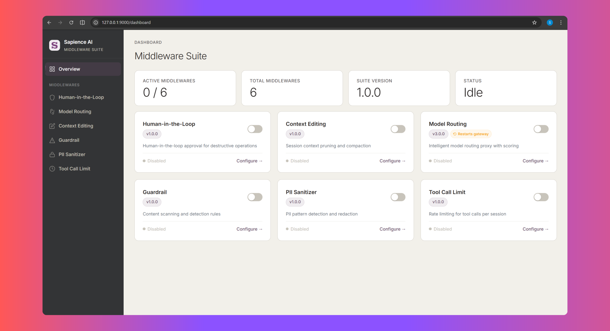

<div align="center">
  
  <br />
  <br />

  <h1>OpenClaw Middleware Suite</h1>

  <h3>
    Because 'Autonomous' shouldn't mean 'Uncontrolled.' 🦞
  </h3>

  <p>A 6-in-1 middleware suite for <b>OpenClaw</b>. These middlewares sit between your agent and and the systems it can affect — intercepting every turn and every tool call, enforcing Human-in-the-Loop gates, redacting PII, blocking prompt injection, routing to the right model, and capping token spend. All locally. Zero telemetry. Nothing leaves your machine.</p>

  <br />

  <p>
    <a href="https://github.com/Sapience-AI/openclaw-middleware-suite/actions/workflows/ci.yml"></a>
    <a href="https://github.com/Sapience-AI/openclaw-middleware-suite/actions/workflows/ci.yml"></a>
    <a href="https://github.com/Sapience-AI/openclaw-middleware-suite/stargazers"></a>
    <a href="LICENSE"></a>
    <a href="http://www.typescriptlang.org/"></a>
    
  </p>

  <p>
    <a href="#plugin">Plugin</a> &nbsp;&bull;&nbsp;
    <a href="#programmatic-usage">Programmatic Usage</a> &nbsp;&bull;&nbsp;
    <a href="#contributing">Contributing</a>
  </p>

  <br />
</div>

---

## The Problem

A single OpenClaw session can read your codebase, run arbitrary shell commands, manage your Google Drive, send emails on your behalf, and push code to production — all autonomously. And every turn along the way spends tokens, picks a model, and accumulates context.

Today there is no layer between _"the agent decided to do something"_ and _"it happened."_ That gap hides three distinct problems — and they rarely share a solution:

- **Safety gaps.** Sandboxing stops the agent from escaping its container. Inside that container, it still holds the keys to the kingdom: API tokens, file system access, outbound network, email credentials. One hallucinated `rm -rf`, one prompt injection buried in a fetched document, one leaked SSN in a tool argument — and you're dealing with real damage.
- **Runaway cost.** Every turn re-sends the full context window. Every request picks whatever model was wired in, whether the task needs it or not. A long coding session on a frontier model can burn through dollars in minutes, most of it spent re-reading stale history at premium rates.
- **Degrading context.** As sessions grow, the agent loses its earliest instructions, forgets key decisions, and starts contradicting itself. Naive truncation throws away what matters; doing nothing blows the budget.

**That's what this suite is for.**

---

## The Solution

Sapience AI acts as the **control plane for OpenClaw**. Six middlewares — each solving a distinct failure mode — work together in a single pipeline.

Four **govern and protect** the action surface:
- **HITL** — Human approval for dangerous actions
- **Guardrail** — Block prompt injection, data exfiltration, destructive commands
- **PII Sanitizer** — Detect & redact sensitive data before it leaves
- **Tool Call Limit** — Enforce session & request budgets

Two **optimize the request itself:**
- **Context Editing** — Intelligent context window compaction, preserving what matters
- **Model Routing** — Route requests to the right model for the job

Together, they ensure every turn is safe, observable, and cost-effective.

---

<h2 id="the-middlewares">The Middlewares</h2>

| # | Middleware | What It Does |
|:-:|---|---|
| 1 | :shield: **HITL** | Human approval for dangerous actions |
| 2 | :brain: **Context Editing** | Intelligent context window compaction |
| 3 | :zap: **Model Routing** | Route requests to the right model & provider |
| 4 | :lock: **Guardrail** | Block prompt injection, exfiltration, destructive commands |
| 5 | :detective: **PII Sanitizer** | Detect & redact personally identifiable information |
| 6 | :bar_chart: **Tool Call Limit** | Enforce session & request budgets per tool |

The suite ships in **two consumption modes**, and the rest of this README is organized around that split:

- **[Plugin](#plugin)** — install once, manage with the dashboard and `sai` CLI. Zero code. The OpenClaw gateway loads the middlewares for you and wires every hook.
- **[Programmatic Usage](#programmatic-usage)** — `import { ... } from '@sapience-ai-corporation/openclaw-middleware-suite/<middleware>'`. Embed any subset directly in a Node app, bring your own pipeline, mix and match.

Both modes share the same on-disk config store, so you can start with the plugin and graduate into programmatic embedding without re-learning anything.

---

<h2 id="plugin">Plugin</h2>

The plugin is the zero-code path: install the npm package, configure once with `sai init`, and the OpenClaw gateway loads all six middlewares and wires every hook. Every operational concern — toggling middlewares on/off, editing policies, viewing audit logs, syncing model catalogs — happens through the dashboard or `sai` CLI.

### Quick Start

#### 1. Install

```bash
# From npm (published plugin)
openclaw plugins install @sapience-ai-corporation/openclaw-middleware-suite

# Or from source
git clone https://github.com/Sapience-AI/openclaw-middleware-suite.git
cd openclaw-middleware-suite
npm install && npm run build
openclaw plugins install --link .
```

#### 2. Configure

```bash
# Interactive wizard — walks you through security level, modules, and policies
sai init

# Start the gateway — dashboard served at http://localhost:9000/dashboard
openclaw gateway start
```

That's it. From here, every middleware can be toggled, configured, and inspected from the [Dashboard](#dashboard) or its dedicated `sai <middleware> …` CLI subcommand (links inside each middleware section below).

### How the Plugin Works

A few facts that apply to all six middlewares once they're loaded as a plugin — worth knowing before you tweak anything:

- **One authoritative disk store.** All six share the same config file: `~/.openclaw/sapience-ai-suite/sapience-ai-suite.json`. The dashboard, the `sai` CLI, and the middlewares themselves all read and write the same JSON. There is no per-middleware config file scattered around the filesystem.
- **Plugin-level on/off flag.** Each middleware has a boolean toggle at `plugin_config.middlewares[name]` in that file (managed via the dashboard's overview page or `sai init`). When the flag is `false`, the plugin runtime short-circuits the corresponding hook — the middleware code isn't executed, so disabling is free of cost.
- **Operational config lives under each middleware's sub-tree.** `hitl`, `context_editing`, `model_routing`, `guardrail`, `pii_sanitizer`, `tool_call_limit` — each owns its own block. (HITL nests its user config under `hitl.policy`; Context Editing under `context_editing.configOverrides`.) These are what the dashboard editors and `sai <middleware>` CLI subcommands manipulate.
- **The plugin runtime always passes `{}` at `initialize()`.** It relies entirely on the disk overlay for configuration. The one exception is **Context Editing**, which receives `{ pluginApi }` so its ICC LLM extraction can dispatch through OpenClaw's plugin API. This is what makes plugin behavior fully reproducible: defaults + whatever's in `sapience-ai-suite.json`, nothing else.

### Middlewares

Quick links: [HITL](#hitl) · [Context Editing](#context-editing) · [Model Routing](#model-routing) · [Guardrail](#guardrail) · [PII Sanitizer](#pii-sanitizer) · [Tool Call Limit](#tool-call-limit).

---

<a id="hitl"></a>

#### :shield: Human-in-the-Loop (HITL)

> **The last line of defense.** Every action your agent takes is evaluated against a security policy. Dangerous actions require explicit human approval before they execute.

##### Why It Exists

AI agents make mistakes. They hallucinate file paths, misinterpret instructions, and occasionally try to do things that would be catastrophic in production. HITL ensures that a human reviews high-risk actions before they happen — not after.

##### How It Works

```
Tool Call Arrives
  │
  ├─ Policy Lookup ─── ALLOW ──→ Execute immediately
  │
  ├─ Policy Lookup ─── DENY ───→ Block with reason
  │
  └─ Policy Lookup ─── ASK ────→ Risk Assessment
                                    │
                                    ├─ Destructive classifier
                                    ├─ Irreversibility scorer (0-100)
                                    └─ Memory risk forecaster
                                    │
                                    ▼
                                 Approval Queue
                                    │
                                    ├─ /approve ──→ Execute
                                    ├─ /approve <TOTP> ──→ Execute (MFA verified)
                                    └─ /deny ──→ Block
```

##### Features — vs. ClawReins

[ClawReins](https://github.com/pegasi-ai/reins) is the closest comparable HITL layer for OpenClaw. The two share a common foundation — three-decision policies, irreversibility scoring, destructive command detection, and a WhatsApp/Telegram approval channel. Sapience HITL extends that foundation in two places that matter most: **a broader set of protected tools, and an approval mechanism the agent can't bypass.**

**Legend:** ✅ supported &nbsp;·&nbsp; ❌ not present

| Feature                                                                                                           |             ClawReins             |        Sapience HITL         |
| ----------------------------------------------------------------------------------------------------------------- | :-------------------------------: | :--------------------------: |
| **Policy model** — `ALLOW` / `DENY` / `ASK` per module & method, with `allowPaths` / `denyPaths` globs            |                ✅                 |              ✅              |
| **Risk scoring** — irreversibility (0–100), destructive classifier (`HIGH` / `CATASTROPHIC`), trajectory forecast |                ✅                 |              ✅              |
| **Approval queue** — async WhatsApp/Telegram + TTY with TTL expiry & trust rate limiting                          |                ✅                 |              ✅              |
| **Immutable audit trail** — append-only JSONL with full risk scores per decision                                  |                ✅                 |              ✅              |
| **Catastrophic-action confirmation**                                                                              |  On-screen `CONFIRM-XXXX` token   |   **TOTP 2FA** (RFC 6238)    |
| **Agent cannot read the approval code** (self-approval prevention)                                                | ❌ token appears in terminal/chat | ✅ code generated off-device |
| **ArgsHash enforcement on retry** (prevents param substitution)                                                   |          ❌ logged only           |   ✅ verified on approval    |
| Protects FileSystem, Shell, Browser, Network, Gateway                                                             |                ✅                 |              ✅              |
| **Gmail** (list, send, draft, delete)                                                                             |                ❌                 |              ✅              |
| **GoogleDrive** (list, upload, download, delete, share, move)                                                     |                ❌                 |              ✅              |
| **Memory** (search, add, delete)                                                                                  |                ❌                 |              ✅              |
| **Process** (list, poll, log, write, kill, clear, remove)                                                         |                ❌                 |              ✅              |
| **Shell subcommand routing** (`gog`, `gdrive`, `rclone` → Gmail/Drive policy)                                     |                ❌                 |              ✅              |
| **Gateway endpoint reclassification** (`gateway.maton.ai/*` auto-mapped)                                          |                ❌                 |              ✅              |
| **MCP tool name mapping** (`mcp__google_workspace__*`)                                                            |                ❌                 |              ✅              |

Any unmapped tool falls through to `defaultAction` (ASK).

##### CLI

```bash
sai hitl policy           # View/manage security policies
sai hitl stats            # View approval statistics
sai hitl audit            # View decision audit trail
sai hitl reset            # Reset statistics
```

---

<a id="context-editing"></a>

#### :brain: Context Editing

> **Intelligent context window compaction.** Long sessions don't lose critical context — the middleware automatically compresses old messages while preserving what matters.

##### Why It Exists

LLM context windows are finite — and expensive. Every token in the context window costs money on every single request. As a session grows, you're paying to re-read thousands of tokens of stale conversation history that the agent no longer needs. A 120K-token session hitting GPT-4 on every turn can burn through dollars in minutes, most of it on context the model is barely using.

And it's not just cost. In long coding sessions, the agent gradually loses its earliest instructions, forgets key decisions, and starts contradicting itself as critical context gets pushed out by noise. Naive truncation throws away important context indiscriminately.

Context Editing solves both problems: it compresses old messages using LLM-powered extraction (ICC), keeping token counts — and costs — under control while preserving the context that actually matters.

##### How It Works

```
Turn Completes
  │
  └─ agent_end hook ──→ Evaluate triggers
                           │
                           ├─ Token count > threshold?
                           ├─ Message count > threshold?
                           └─ Adaptive rules?
                           │
                           ▼
                        Schedule compaction (if triggered)

Next Turn Begins
  │
  └─ before_agent_start hook ──→ Compact
                                   │
                                   ├─ Run ICC extraction
                                   │    ├─ Priority Preservation
                                   │    ├─ Conflict Resolution
                                   │    └─ Entity Locks
                                   │
                                   ▼
                                Replace old messages with dense summary
                                (before SessionManager opens the JSONL)
```

The two-phase design ensures compaction happens *before* SessionManager opens the JSONL file, preventing race conditions.

##### ICC Pipeline (Intelligent Context Compression)

| Stage                     | What It Extracts                                                |
| ------------------------- | --------------------------------------------------------------- |
| **Priority Preservation** | Critical objectives and instructions the agent must not forget  |
| **Conflict Resolution**   | Contradictions in the transcript are detected and resolved      |
| **Entity Locks**          | Key values (names, paths, config values) are preserved verbatim |

##### Features — vs. OpenClaw's Built-in Compaction

OpenClaw already ships a robust compaction pipeline: when a prompt would overflow the context window, it splits the transcript into chunks, summarizes each one, then merges the partials — a bulk summarizer built to survive oversized tool outputs, tool-call pairing constraints, and transient API failures. Sapience Context Editing **does not replace that pipeline — it adds a cheaper, steerable fast path on top of it.**

The fast path is a **single LLM call** whose output (the ICC extraction: entities, conflicts, priorities) _is_ the compaction summary. One call means the prompt can be user-steered, the model can be swapped, and compaction can fire early on your own thresholds instead of waiting for overflow. If the ICC call ever fails — for example, on a transcript too large for the extraction model's window — the middleware simply skips that turn and OpenClaw's native overflow-triggered compaction handles it on the next prompt exactly as it would for a vanilla install. You never lose coverage; you just lose the steering on the overflow edge case.

**Legend:** ✅ supported &nbsp;·&nbsp; ❌ not present

| Feature                                                                                                        |     OpenClaw built-in      |         Sapience Context Editing         |
| -------------------------------------------------------------------------------------------------------------- | :------------------------: | :--------------------------------------: |
| **Compaction pipeline** — summarize old messages into a dense summary                                          | ✅ two-stage chunk + merge |    ✅ single ICC call as the summary     |
| **Overflow-triggered compaction** (fires when next prompt exceeds context window)                              |             ✅             |                    ✅                    |
| **Manual `/compact` command**                                                                                  |             ✅             |                    ✅                    |
| **Identifier preservation** — UUIDs, hashes, URLs, file names kept verbatim                                    |             ✅             |                    ✅                    |
| **Early / proactive compaction** before hitting the context limit                                              |      ❌ reactive only      |          ✅ threshold-triggered          |
| **Token-count threshold** for early compaction (default 80k, configurable)                                     |             ❌             |                    ✅                    |
| **Message-count threshold** for early compaction (default 50, configurable)                                    |             ❌             |                    ✅                    |
| **Trigger mode selector** — `token` / `message` / `both`                                                       |             ❌             |                    ✅                    |
| **Keep N recent messages verbatim** before the compaction cut                                                  |    ❌ fixed chunk ratio    |           ✅ user-configurable           |
| **Keep N recent tokens verbatim** before the compaction cut                                                    |   ❌ internal knob only    |           ✅ user-configurable           |
| **Custom compaction prompt** — user-supplied instructions steer what the summary preserves                     |   ❌ fixed merge prompt    |    ✅ injected on the single ICC call    |
| **Typed Entity Locks** — API endpoints, file paths, variables, constants, model names, code identifiers        |             ❌             |                    ✅                    |
| **Conflict Resolution** — detects instruction overrides ("use X instead of Y") and locks the resolved value    |             ❌             |                    ✅                    |
| **Priority Preservation** — `TODO` / `FIXME` / `REQUIREMENT` / `MUST` segments flagged for verbatim carry-over |             ❌             |                    ✅                    |
| **Custom compaction model** — run summarization on a different model than the agent                            | ➕ raw `openclaw.json` key | ✅ first-class via `sai ctx model --set` |
| **Session pruning toggle** (cache-TTL for idle contexts)                                                       | ➕ raw `openclaw.json` key |   ✅ first-class via `sai ctx pruning`   |
| **Interactive wizard** for all of the above                                                                    |             ❌             |              ✅ `sai init`               |
| **Per-compaction audit trail** (JSONL: entities, conflicts, priorities, instruction hash)                      |             ❌             |                    ✅                    |
| **Per-session cumulative token-savings stats**                                                                 |             ❌             |                    ✅                    |

##### CLI

```bash
sai ctx stats     # Compaction state, token savings, and compaction history
sai ctx reset     # Clear compaction state
```

---

<a id="model-routing"></a>

#### :zap: Model Routing

> **Route every request to the right model.** Simple tasks go to fast, cheap models. Complex reasoning goes to the best. Automatic fallbacks, multi-provider support, and real-time cost tracking.

##### Why It Exists

Not every request needs GPT-4 or Claude Opus. A simple "list files in this directory" doesn't need a $0.015/1K-token model — but without routing, that's what it gets. Model Routing scores request complexity in real time and routes to the optimal model tier, cutting costs by up to 70% without sacrificing quality where it matters.

##### How It Works

```
Incoming Request
  │
  ├─ Complexity Scorer
  │    ├─ Message length
  │    ├─ Instruction complexity
  │    ├─ Tool usage patterns
  │    └─ Reasoning depth signals
  │
  ├─ Tier Assignment ──→ simple | standard | complex | reasoning
  │
  ├─ Model Selection ──→ Primary model for tier
  │    └─ Fallback chain if primary fails
  │
  └─ Provider Routing ──→ Route to correct API endpoint
       ├─ OpenAI format
       ├─ Anthropic format
       └─ Google format
```

##### Tier System

| Tier          | Use Case                                   | Example Models             |
| ------------- | ------------------------------------------ | -------------------------- |
| **Simple**    | File reads, listing, basic Q&A             | GPT-4o-mini, Claude Haiku  |
| **Standard**  | Code generation, moderate reasoning        | GPT-4o, Claude Sonnet      |
| **Complex**   | Architecture decisions, complex refactors  | GPT-4, Claude Opus         |
| **Reasoning** | Multi-step planning, novel problem solving | o1, Claude Opus (extended) |

##### Features — vs. Manifest

[Manifest](https://github.com/mnfst/manifest) is the closest comparable complexity-based model router — both share the same 23-dimension scoring core derived from the same lineage. The two target different deployment models: Manifest ships as a Docker service with a multi-tenant web dashboard and Postgres backend; Sapience Model Routing is an OpenClaw plugin running on the developer's machine with a local JSON config and CLI. The table below focuses on what Sapience adds on top of the shared scoring foundation — in particular **per-session model pinning** and **auto prompt-cache marker injection**, which compound to keep the provider's cached prefix warm across every turn of a pinned session.

**Legend:** ✅ supported &nbsp;·&nbsp; ❌ not present

| Feature                                                                                                                                                          |                        Manifest                        |                                Sapience Model Routing                                 |
| ---------------------------------------------------------------------------------------------------------------------------------------------------------------- | :----------------------------------------------------: | :-----------------------------------------------------------------------------------: |
| **23-dimension scorer** — Aho-Corasick trie, density clustering, sigmoid (k=8) with 0.45 ambiguity threshold, four-tier boundaries                               |                       ✅ parity                        |                                       ✅ parity                                       |
| **Session momentum** — length-weighted blend of the last 5 tier decisions                                                                                        |                           ✅                           |                                          ✅                                           |
| **Request deduplication** — concurrent retries / double-clicks share one upstream call (30s window)                                                              |               ✅ trace-id / token-based                |                            ✅ SHA-256 inflight + completed                            |
| **Capability-filtered fallback chain** — filters by tool support, vision, context window, exclusions                                                             |                           ✅                           |                                   ✅ max 5 per tier                                   |
| **Native provider adapters** — OpenAI / Anthropic / Google with SSE streaming conversion                                                                         |           ✅ (+ ChatGPT Codex subscription)            |                                          ✅                                           |
| **Hard overrides** — reasoning keyword, short-message, tool-floor, large-context                                                                                 |                     ✅ 4 overrides                     | ✅ 6 overrides (+ structured-output floor + session-startup `/new` `/reset` → SIMPLE) |
| **Multilingual keywords** — 9 languages, 1,500+ keywords across all 14 keyword dimensions                                                                        |                    ❌ English only                     |                                          ✅                                           |
| **Routing profiles** — `auto` / `eco` / `premium` / `agentic` switch the whole fallback chain in one setting                                                     |              ❌ single deterministic map               |                                          ✅                                           |
| **Model pinning** — the same session keeps the same model across every turn, with auto-release on complexity escalation                                          |                 ❌ tier-only momentum                  |                            ✅ per-session high-water mark                             |
| **Three-strike escalation** — user retries an identical request 3× → auto-bump to next tier                                                                      |                           ❌                           |                                          ✅                                           |
| **Auto cache-marker injection** — Anthropic `cache_control` on last system block + last tool, Google `cachedContent` token passthrough                           |                   ✅ Anthropic only                    |                                 ✅ Anthropic + Google                                 |
| **Session-pinned prompt caching** — pinning + injection compound so the provider's cached prefix survives across turns (up to 90% off cached input on Anthropic) | ❌ no pinning → prefix drops whenever the model drifts |                                          ✅                                           |
| **Deterministic response cache** — LRU for `temperature=0` non-streaming requests (bypasses the provider entirely on repeat identical prompts)                   |                           ❌                           |                            ✅ opt-in, 200 entries / 10 min                            |
| **Daily cost alerts** — warn / critical thresholds that fire once per day on top of a 90-day ledger                                                              |         ❌ notifications exist, no budget caps         |                     ✅ `$5` warn / `$20` critical (configurable)                      |
| **Per-step audit log** — request-id-scoped JSONL trace of every routing decision                                                                                 |             Postgres `agent_message` rows              |                                    ✅ local JSONL                                     |
| **Config hot-reload** (`sapience-ai-suite.json`)                                                                                                                 |                  ❌ restart required                   |                            ✅ `fs.watchFile`, 2s debounce                             |
| **Plugin hook system** — `onBeforeScore` / `onAfterScore` / `onBeforeForward` / `onAfterForward`                                                                 |                           ❌                           |                                      ✅ 4 hooks                                       |
| **Full CLI** — `sai router stats / config / tiers / test / exclude / models / reset`                                                                             |                           ❌                           |                                          ✅                                           |
| **Interactive setup wizard** — profile + tier customization + port + live catalog pull                                                                           |                  Web dashboard signup                  |                                     ✅ `sai init`                                     |
| **Specificity routing** — task-type categories (coding / vision / trading / …) override complexity tier                                                          |                    ✅ 9 categories                     |                                          ❌                                           |
| **Subscription OAuth** — ChatGPT Plus, Claude Max, MiniMax, GitHub Copilot                                                                                       |                           ✅                           |                                   ❌ API keys only                                    |

##### CLI

```bash
sai router stats       # Daily cost ledger + per-model breakdown + alerts
sai router config      # View / edit profile, thresholds, exclusions
sai router tiers       # Inspect tier-to-model assignments
sai router models      # Sync live model catalog (LiteLLM, 24h cache)
sai router test        # Score a sample request without forwarding
sai router reset       # Reset cost history / session state
```

> **Note:** Toggling Model Routing on/off requires a gateway restart. The dashboard handles this automatically with a reconnection overlay.

---

<a id="guardrail"></a>

#### :lock: Guardrail

> **Multi-layer defense against prompt injection, data exfiltration, and destructive commands.** Scans both input and output surfaces with regex, heuristic, and entropy-based detection.

##### Why It Exists

Prompt injection is the #1 attack vector against AI agents. A single malicious instruction hidden in a document, email, or web page can hijack your agent's behavior — making it exfiltrate secrets, delete data, or execute arbitrary commands. Guardrail catches these attacks at multiple detection layers before they can cause harm.

##### Detection Layers

| Layer                  | Technique              | What It Catches                                |
| ---------------------- | ---------------------- | ---------------------------------------------- |
| **Regex Scanner**      | Pattern matching       | Known injection patterns, role overrides       |
| **Prefix Scanner**     | Known-prefix detection | Common injection prefixes and escape sequences |
| **Heuristic Scanner**  | Behavioral analysis    | Unusual request patterns, multi-step attacks   |
| **Entropy Analyzer**   | Randomness detection   | Encoded payloads, obfuscated data exfiltration |
| **Unicode Normalizer** | Canonicalization       | Unicode escape attacks, homoglyph substitution |
| **OpenAI Moderation API** | ML content classifier (external) | Violence, hate, sexual, self-harm, illicit content — result cached at `before_agent_start`, severity-tiered enforcement at `before_message_write` (default: rewrite on `HIGH` + `CRITICAL`; `MEDIUM` is audit-only) |

##### Guard Modules

| Guard                    | What It Protects                                                 |
| ------------------------ | ---------------------------------------------------------------- |
| **Sensitive Paths**      | Blocks access to `~/.ssh`, `~/.aws`, `/etc/passwd`, `.env` files |
| **Egress Control**       | Prevents unauthorized data transmission to external endpoints    |
| **Destructive Commands** | Catches `rm -rf`, `DROP TABLE`, `kill -9`, and similar patterns  |
| **Content Moderation**   | OpenAI Moderation API check on incoming prompts — flags violence, hate, sexual, self-harm, illicit content (async → sync cache bridge; severity-tiered via `moderation.rewriteThreshold`, default `HIGH`) |
| **Role Impersonation**   | Detects attempts to masquerade as system/admin roles             |
| **Canary Tracker**       | Honeypot tokens that trigger alerts if exposed in output         |
| **Output Scrubber**      | Removes middleware metadata from agent responses                 |

##### Key Features

- **Input + output scanning** — Covers both prompt injection and data leakage
- **Configurable actions** — `BLOCK`, `WARN`, `REDACT` per rule
- **Confidence filtering** — Adjustable sensitivity to reduce false positives
- **Dry-run mode** — Log detections without blocking (for tuning)
- **Custom patterns** — Add your own regex rules for domain-specific threats

##### Features — vs. OpenClaw Shield & OpenGuardrails

The two closest comparables are [**OpenClaw Shield**](https://github.com/knostic/openclaw-shield) (Knostic) — a lightweight OpenClaw plugin with five independently-toggleable policy layers, including an advisory "security gate" tool that relies on the agent obeying injected instructions — and [**OpenGuardrails / MoltGuard**](https://github.com/OpenGuardrails) — a full-stack platform with an agent-side plugin talking to a hosted Core service that runs a 10-scanner content model and a behavioral rule engine over tool-call sequences. Sapience Guardrail takes a different stance from both: **everything runs in-process on OpenClaw's native hooks**, and the `before_message_write` hook **actually rewrites the persisted transcript** so the LLM can never see the pre-redacted content — not just on the next turn, but on the current one. The rows below focus on the capabilities that actually differ; shared basics (regex scanning, OpenClaw plugin integration, PII redaction) are omitted.

**Legend:** ✅ supported &nbsp;·&nbsp; ⚠️ partial &nbsp;·&nbsp; ❌ not present

| Feature                                                                                                            |  OpenClaw Shield  |      OpenGuardrails       |                               Sapience Guardrail                               |
| ------------------------------------------------------------------------------------------------------------------ | :---------------: | :-----------------------: | :----------------------------------------------------------------------------: |
| **Prompt injection regex / pattern scanner**                                                                       |        ✅         |   ✅ (hosted Core S01)    |                                ✅ (21 patterns)                                |
| **Heuristic / Shannon-entropy detector** for obfuscated payloads                                                   |        ❌         |            ❌             |                         ✅ (≥ 4.0 on 20+ char tokens)                          |
| **Unicode NFKC normalization** before scan — homoglyph + zero-width + soft hyphen                                  |        ❌         |            ❌             |                                       ✅                                       |
| **External moderation API integration** (OpenAI Moderation, Perspective, …)                                        |        ❌         | ⚠️ gateway sanitizer only |                ✅ OpenAI Moderation, async → sync cache bridge                 |
| **Sensitive file path blocking** (`.ssh`, `.env`, `.aws/credentials`, …)                                           |  ✅ 18 patterns   |            ❌             |                      ✅ 52 patterns + symlink resolution                       |
| **Outbound domain allowlist** (default-deny)                                                                       |        ❌         |            ❌             |              ✅ 25 allowed (npm, PyPI, GitHub, AWS, Cloudflare…)               |
| **Private-IP / metadata-endpoint SSRF block** (`169.254.169.254`, RFC 1918, IPv6 ULA, mapped `::ffff:`)            |        ❌         |            ❌             |                                       ✅                                       |
| **Destructive shell command blocking** (`rm -rf`, `DROP TABLE`, `git push --force main`, fork bombs, `chmod 777`…) |   ✅ 6 patterns   |   ❌ (behavioral only)    |                         ✅ 22 built-in + custom regex                          |
| **Role-impersonation / ChatML / fake `[SYSTEM]` neutralization**                                                   |        ❌         |            ❌             |             ✅ 16 patterns incl. Llama markers & tool-output tags              |
| **Canary / leakback re-redaction** (re-detect previously-redacted content)                                         |        ❌         |            ❌             |                 ✅ SHA-256 ring buffer, whitespace-normalized                  |
| **Actual message rewrite that persists to transcript** (vs log-only or post-persist redaction)                     |        ❌         |            ❌             | ✅ `before_message_write` returns `{ message }` per OpenClaw 2026.4.x contract |
| **Async → sync cache bridge** — external API check in `before_agent_start`, severity-tiered rewrite in sync `before_message_write` (configurable threshold) |        ❌         |            ❌             |                                       ✅                                       |
| **Behavioral rule engine over tool-call sequences** (e.g. file read → external write)                              |        ❌         |      ✅ hosted Core       |                                       ❌                                       |
| **Advisory "security gate" LLM-policy tool** the agent is prompted to call                                         |       ✅ L5       |            ❌             |                                       ❌                                       |
| **Dry-run / shadow mode** (log without blocking)                                                                   |        ✅         |        ⚠️ unclear         |                                       ✅                                       |
| **Per-decision JSONL audit log** — timestamp, module, severity, sessionKey, agentId                                |        ❌         |      ✅ (hosted DB)       |                              ✅ local append-only                              |
| **Full CLI surface** for runtime config                                                                            | ❌ JSON edit only | ✅ `/og_*` slash commands |                              ✅ `sai guardrail …`                              |
| **Web dashboard**                                                                                                  |        ❌         |    ✅ localhost:53668     |                                  ❌ (planned)                                  |
| **Runs fully in-process** (no external service dependency)                                                         |        ✅         |   ❌ requires Core API    |                                       ✅                                       |
| **Multi-tenant managed service** with billing / quotas                                                             |        ❌         |            ✅             |                                       ❌                                       |

**What's genuinely unique to each**

- **OpenClaw Shield** — per-layer toggles (L1–L5) so you can ship a degraded config when a host lacks a given hook; advisory L5 gate relies on the agent obeying injected policy rather than host enforcement.
- **OpenGuardrails / MoltGuard** — hosted behavioral rule engine that catches multi-turn attack patterns (credential read → network write), a 10-scanner content model spanning NSFW / MCP poisoning / off-topic drift, and a managed dashboard with a quota system.
- **Sapience Guardrail** — synchronous transcript rewrite so the LLM never sees pre-redacted content; Unicode NFKC + homoglyph + zero-width normalization pre-scan; entropy-based obfuscation detection; full-depth L2 stack (sensitive-paths + egress allowlist + private-IP SSRF + destructive commands) firing before any tool executes; confidence-filtered matching to suppress rephrasing false positives.

##### What We Adopted From Each

Sapience Guardrail did not emerge in a vacuum. Both comparables contributed foundational ideas we built on — we name them explicitly below.

| Capability | OpenGuardrails | OpenClaw Shield | Sapience Guardrail |
|---|:-:|:-:|:-:|
| **Regex rule engine with category taxonomy** (injection / PII / suspicious) | Adopted from | — | Extended: 53 rules across 3 engines (regex + prefix + heuristic) |
| **Confidence tiers** (HIGH / MEDIUM / LOW) | Adopted from | — | Extended: cross-category *and* same-category multi-match required for MEDIUM |
| **L2 tool-call interception** via `before_tool_call` hook | — | Adopted from | Extended: 6 guards (sensitive-paths, egress, destructive, shell-indirection, pre-read, param scan) |
| **File path blocklist** concept | — | Adopted from | Extended: 52 patterns + allowlist overrides + symlink resolution |
| **L3 transcript scanning** via `before_message_write` | — | — | Original — closes the gap Shield left open (tool results, file content entering *after* execution) |
| **L1 prompt-guard policy injection** into system prompt | — | — | Original — agent learns *what* is protected, never *how* |
| **Egress / SSRF prevention** (domain allowlist, IPv4+IPv6 private ranges, `169.254.169.254`) | — | — | Original |
| **Canary tracking / leakback re-redaction** (SHA-256 ring buffer) | — | — | Original |
| **Role impersonation** (ChatML, Llama, fake `[SYSTEM]`, tool-output tag injection — 16 patterns) | — | — | Original |
| **Agent interrogation defense** (defense-enumeration detection) | — | — | Original |
| **OpenAI Moderation API integration** with async → sync cache bridge | — | — | Original |
| **CLI management surface** (`sai guardrail …`) | — | — | Original |

**The one thing neither comparable does:** combine pre-execution interception *with* post-execution transcript scanning. OpenGuardrails scans text but can't block tools. OpenClaw Shield blocks tools but can't scan transcripts. Sapience does both in the same pipeline.

##### Configuration

```json
{
  "dryRunMode": false,
  "entropyThreshold": 4.0,
  "sensitivePaths": { "enabled": true, "action": "BLOCK" },
  "egressControl": { "enabled": true, "blockDataSending": true },
  "destructiveCommands": { "enabled": true, "action": "BLOCK" },
  "moderation": { "rewriteThreshold": "HIGH" }
}
```

The middleware's on/off switch is the plugin-level flag (`plugin_config.middlewares.guardrail` in `sapience-ai-suite.json`, managed via the dashboard or `sai init`), not a field inside this config. The sub-feature `enabled` flags above (sensitivePaths, egressControl, destructiveCommands) toggle individual guards *within* the guardrail middleware when it's already running.

`moderation.rewriteThreshold` controls the severity bar for the async → sync cache bridge. Accepts `MEDIUM`, `HIGH`, or `CRITICAL` — default is `HIGH`. Flags at or above the threshold trigger a transcript rewrite in `before_message_write` (hard block); flags below are logged audit-only and pass through so the LLM's own safety layer can handle the gray zone without a synthetic `[GUARDRAIL]` marker replacing the user's prompt. Set to `MEDIUM` for maximum strictness, or `CRITICAL` to only hard-block the most severe categories.

##### CLI

```bash
sai guardrail status                      # Show guardrail state
sai guardrail toggle dry-run              # Toggle dry-run mode on/off
sai guardrail list [category]             # List rules (optionally filtered)
sai guardrail rule-add <name> <category>  # Add a custom regex rule
sai guardrail rule-toggle <name>          # Enable/disable a rule
sai guardrail paths block <pattern>       # Block a sensitive path
sai guardrail egress allow <domain>       # Whitelist an egress domain
sai guardrail egress data-sending <on|off># Toggle outbound body blocking
sai guardrail destructive list            # List blocked command patterns
sai guardrail destructive add <pattern>   # Add a custom destructive pattern
sai guardrail config                      # Print resolved config
sai guardrail reset                       # Reset to defaults
```

> **Note:** `moderation.rewriteThreshold` is currently file-level only — edit the `guardrail` key in `sapience-ai-suite.json`. A dedicated CLI subcommand is not yet wired up.

---

<a id="pii-sanitizer"></a>

#### :detective: PII Sanitizer

> **Detect and redact personally identifiable information before it leaves your system.** Field-level DLP policies with recursive deep scanning across all tool call arguments.

##### Why It Exists

AI agents process everything in their context — including sensitive data users paste into conversations. Without a PII layer, an agent can inadvertently pass SSNs, API keys, or email addresses to external APIs, log them to files, or include them in shell commands. The PII Sanitizer intercepts tool calls and applies data loss prevention policies before execution.

##### Detection Patterns

| Category                    | Examples                 | Default Severity |
| --------------------------- | ------------------------ | ---------------- |
| **Email addresses**         | `user@example.com`       | LOW              |
| **Phone numbers**           | `+1-555-0123`            | MEDIUM           |
| **Social Security Numbers** | `123-45-6789`            | CRITICAL         |
| **Credit card numbers**     | `4111-1111-1111-1111`    | CRITICAL         |
| **API keys & tokens**       | `sk-proj-...`, `ghp_...` | CRITICAL         |
| **IP addresses**            | `192.168.1.1`            | LOW              |

##### DLP Actions

| Action     | Behavior                                       |
| ---------- | ---------------------------------------------- |
| `ALLOW`    | Pass through (validation only)                 |
| `REDACT`   | Replace PII with `[REDACTED_<TYPE>]` placeholder |
| `ESCALATE` | Force HITL approval before proceeding          |
| `BLOCK`    | Block the tool call entirely                   |

##### Key Features

- **Recursive deep scanning** — Traverses nested objects, arrays, and stringified JSON
- **Shell argument parsing** — Extracts and scans literals from shell commands
- **Field-level policies** — Different actions per PII type and severity
- **Severity classification** — `LOW`, `MEDIUM`, `HIGH`, `CRITICAL`
- **Integrates with HITL** — `ESCALATE` action routes to human approval

##### CLI

```bash
sai dlp info                                    # Show DLP status, toggles, rules, tool mappings
sai dlp toggle <enable|disable|dry-run>         # Toggle DLP settings
sai dlp rule-add <name> [options]               # Add or update a PII scanning rule
sai dlp rule-rm <name>                          # Remove a PII scanning rule by name
sai dlp policy-set <tool> <field> <action>      # Set scanning policy for a tool field
```

---

<a id="tool-call-limit"></a>

#### :bar_chart: Tool Call Limit

> **Budget enforcement for AI agent execution.** Prevents runaway loops and resource exhaustion with per-session and per-request call limits.

##### Why It Exists

An agent stuck in a loop can call the same tool hundreds of times in a single session — burning through API quotas, racking up costs, and producing garbage output. Tool Call Limits enforce hard boundaries on how many times each tool can be called, at both the session and request level.

##### Enforcement Model

```
Tool Call Arrives
  │
  ├─ Check session counter ─── Under limit ──→ PASS
  │                        └── Soft limit ───→ WARN + PASS
  │                        └── Hard limit ───→ BLOCK
  │
  └─ Check request counter ─── Under limit ──→ PASS
                           └── Soft limit ───→ WARN + PASS
                           └── Hard limit ───→ BLOCK
```

##### Default Budgets

| Scope         | Global    | Gmail/Drive Ops |
| ------------- | --------- | --------------- |
| Session limit | 100 calls | 50 calls        |
| Request limit | 20 calls  | 10-20 calls     |

##### Key Features

- **Two enforcement scopes** — Session-level and request-level budgets
- **Soft + hard limits** — Warn before blocking
- **Per-method granularity** — Different limits for `FileSystem.read` vs `Gmail.send`
- **Rolling windows** — 24-hour configurable window for counter resets
- **Session tracking** — Maps virtual session IDs to real session keys

##### vs. OpenClaw `tools.loopDetection`

OpenClaw core ships a built-in `tools.loopDetection` guard that detects **degenerate call patterns** — same tool + same params repeated, known polling with no state change, ping-pong alternation — over a sliding window. It is **pattern-based** and disabled by default. Sapience Tool Call Limits is **budget-based**: it counts cumulative calls against a numeric quota. The two solve different failure modes and are designed to run together.

| Failure mode                                                        | OpenClaw loop detector | Sapience Limits |
| ------------------------------------------------------------------- | :--------------------: | :-------------: |
| `Gmail.read` polled 50× with identical params                       |           ✅           |       ✅        |
| `Gmail.send` to 50 different recipients in one session (spam/exfil) |    ❌ params differ    |       ✅        |
| Agent paginates legitimately 100× with varying cursors              | ⚠️ may false-positive  |    ✅ bounded   |
| Ping-pong `Read → Write → Read → Write`                             |           ✅           |       ❌        |
| Cost blowup: 1000 cheap-looking calls, none repeated                |     ❌ no pattern      |       ✅        |
| Request-level runaway (20+ calls in a single turn, all different)   |           ❌           |       ✅        |

**Differentiators beyond pattern-vs-budget:**

- **Dual enforcement scopes** — session (lifetime) *and* request (single turn) budgets evaluated on every call
- **Per-module × per-method granularity** — `Gmail.send` has a different budget than `FileSystem.read`
- **Soft + hard tiers** — warn before blocking, so operators see approach-to-limit
- **Rolling 24h window** — counters reset automatically rather than requiring manual intervention
- **Built-in observability** — `sai limits status` and the dashboard page expose live counters; OpenClaw's detector only logs when it fires

**Recommended setup:** enable both. OpenClaw's detector catches degenerate *shapes* cheap; Sapience Limits catches budget overruns the pattern detector can't see (distributed loops, cost blowups, request-level runaway).

##### CLI

```bash
sai limits stats     # View current usage
sai limits show      # View limit policies
sai limits reset     # Reset counters
```

---

<h3 id="dashboard">Dashboard</h3>

> Real-time configuration and monitoring UI for all six middlewares.

<p align="center">
  
</p>

The dashboard is a **Preact single-page application** served by the OpenClaw gateway. It provides live configuration, status monitoring, and log streaming for every middleware in the suite.

**Pages:**

| Page                 | What You Can Do                                                    |
| -------------------- | ------------------------------------------------------------------ |
| **Overview**         | Toggle middlewares on/off, view system-wide health stats           |
| **HITL**             | View pending approvals, decision audit trail, policy visualization |
| **Context Editing**  | Session history, compaction statistics, entity locks               |
| **Model Routing**    | Route metrics, cost trends, tier configuration                     |
| **Guardrail**        | Threat detection log, rule configuration, egress controls          |
| **PII Sanitizer**    | Detection patterns, DLP policy editor                              |
| **Tool Call Limits** | Usage tracking, limit configuration                                |

**Tech stack:** Preact + preact-router, @preact/signals for state, uPlot for charts, SSE for real-time streaming.

---

### Plugin Manifest

This is what OpenClaw's plugin loader sees when the suite is registered:

```json
{
  "id": "sapience-ai-suite",
  "entry": "dist/plugin/index.js",
  "hooks": [
    "before_tool_call",
    "before_prompt_build",
    "before_agent_start",
    "before_message_write",
    "agent_end",
    "llm_output"
  ]
}
```

The entry exports `SapienceMiddlewarePlugin` (a default-export object conforming to `SapienceMiddlewareManifest`). The loader registers each declared hook and dispatches to the in-process pipeline runner (`MiddlewareRegistry`).

---

<h2 id="programmatic-usage">Programmatic Usage</h2>

The suite is published as a single npm package with **one subpath per middleware**. Importing HITL doesn't pull in router or guardrail code, and each subpath is tree-shakeable on its own. You construct middlewares directly, optionally hand them to a `MiddlewareRegistry`, and call lifecycle methods yourself.

### Quick Start

```bash
npm install @sapience-ai-corporation/openclaw-middleware-suite
```

```ts
import { MiddlewareRegistry } from '@sapience-ai-corporation/openclaw-middleware-suite';
import { HitlMiddleware } from '@sapience-ai-corporation/openclaw-middleware-suite/hitl';
import { GuardrailMiddleware } from '@sapience-ai-corporation/openclaw-middleware-suite/guardrail';

const hitl = new HitlMiddleware();
const guard = new GuardrailMiddleware();

await hitl.initialize({ defaultAction: 'ASK' });
await guard.initialize({ dryRunMode: false });

const registry = new MiddlewareRegistry();
registry.register(hitl);
registry.register(guard);

// In your tool-call dispatcher:
const result = await registry.runBeforeToolCall(ctx);
if (result.block) throw new Error(result.reason);
```

That's the full embedding shape: import → construct → `initialize()` → register → call lifecycle methods (`runBeforeToolCall`, `runBeforeAgentStart`, etc.). Everything else below is detail on the contract, the configuration paths, and the per-middleware programmatic surface.

### Root Surface

The root package only exposes cross-cutting framework concerns — pipeline runner, base contract, plugin lifecycle. Middleware classes live under their own subpaths.

```ts
import {
  // Plugin lifecycle
  registerPlugin,
  unregisterPlugin,
  isPluginRegistered,

  // Pipeline runner
  MiddlewareRegistry,

  // Base pipeline contract
  Middleware,
  MiddlewareContext,
  MiddlewareResult,

  // Plugin entry (what OpenClaw's loader imports)
  SapienceMiddlewarePlugin,
  SapienceMiddlewareManifest,
} from '@sapience-ai-corporation/openclaw-middleware-suite';
```

Base pipeline contract:

```ts
interface Middleware {
  readonly name: string;
  readonly version: string;
  initialize(config: Record<string, unknown>): Promise<void>;

  // Tool-call pipeline
  beforeToolCall?(context: MiddlewareContext): Promise<MiddlewareResult>;
  afterToolCall?(context: MiddlewareContext, result: unknown): Promise<void>;

  // OpenClaw lifecycle events (implement only the surfaces you need)
  beforeAgentStart?(context: AgentStartContext): Promise<AgentStartResult | void>;
  beforePromptBuild?(context: PromptBuildContext): Promise<PromptBuildResult | void>;
  beforeMessageWrite?(
    context: MessageWriteContext
  ): MessageWriteResult | undefined | Promise<MessageWriteResult | undefined>;
  agentEnd?(context: AgentEndContext): Promise<void>;
  llmOutput?(context: LlmOutputContext): Promise<void>;

  // Lifecycle / reporting
  getStatus(): { enabled: boolean; stats?: Record<string, unknown> };
  shutdown?(): Promise<void>;
}

interface MiddlewareResult {
  block: boolean;
  reason?: string;
  modifiedParams?: Record<string, unknown>;
  /** First-class "force human approval" signal — guardrail WARN and PII
   *  ESCALATE both surface here so orchestrators read one consistent field. */
  escalate?: boolean;
  escalateReason?: string;
  metadata?: Record<string, unknown>;
}
```

Every lifecycle context (`MiddlewareContext`, `AgentStartContext`, `PromptBuildContext`, `MessageWriteContext`, `AgentEndContext`, `LlmOutputContext`) extends a shared `LifecycleContext` base, so session-scoped fields (`sessionKey`, `agentId`, `runId`, `metadata`) live in the same place regardless of which event fired.

> `MiddlewareResult.reason` (pipeline-level) is distinct from `BeforeToolCallResult.blockReason` (the OpenClaw `before_tool_call` hook return contract). See the note under [HITL → Programmatic API](#programmatic-hitl) for why the two coexist.

### Middleware Subpaths

| Middleware | Subpath | Primary class |
|---|---|---|
| [HITL](#programmatic-hitl) | `@sapience-ai-corporation/openclaw-middleware-suite/hitl` | `HitlMiddleware` |
| [Context Editing](#programmatic-context-editing) | `@sapience-ai-corporation/openclaw-middleware-suite/context-editing` | `ContextEditingMiddleware` |
| [Model Routing](#programmatic-model-routing) | `@sapience-ai-corporation/openclaw-middleware-suite/model-routing` | `ModelRoutingMiddleware` |
| [Guardrail](#programmatic-guardrail) | `@sapience-ai-corporation/openclaw-middleware-suite/guardrail` | `GuardrailMiddleware` |
| [PII Sanitizer](#programmatic-pii-sanitizer) | `@sapience-ai-corporation/openclaw-middleware-suite/pii-sanitizer` | `PiiSanitizerMiddleware` |
| [Tool Call Limit](#programmatic-tool-call-limit) | `@sapience-ai-corporation/openclaw-middleware-suite/tool-call-limit` | `ToolCallLimitMiddleware` |

> **Subpath exports** require Node ≥ 18 and TypeScript ≥ 4.7 with `moduleResolution: "node16" | "nodenext" | "bundler"`. A `typesVersions` fallback is provided in `package.json` for consumers on legacy `moduleResolution: "node"`.

### Precedence at `initialize(config)`

Every middleware in the suite resolves config the same way:

```
DEFAULTS  <  inline config  <  sapience-ai-suite.json disk overlay
```

Three things to know about how this plays out for embedded consumers:

1. **The disk overlay is optional but always wins when present.** If `~/.openclaw/sapience-ai-suite/sapience-ai-suite.json` exists (because the user ran `sai init`, or the dashboard wrote to it, or another instance saved earlier), its values shadow whatever you pass inline. Apps that want fully reproducible config should ensure the file isn't on disk (see *Hermetic embedding* below).
2. **The plugin runtime always passes `{}`** (or `{ pluginApi }` for Context Editing). That's why plugin behavior is "defaults + disk, nothing else" — there's no inline layer to compete with the dashboard's writes.
3. **Three configuration paths.** Each middleware supports the same three ways to set its config:
   - **Inline at `initialize(config)`** — pass a partial of the middleware's config type. Applied on top of defaults, below the disk overlay.
   - **In-process `updateConfig(partial)`** — patches the running instance in memory; **no disk I/O**, no cross-process visibility. Best for embedded apps that don't want to touch `sapience-ai-suite.json`.
   - **Disk-backed `Store.update()` / `Store.save()` + reload** — persists to `sapience-ai-suite.json`, survives restarts, propagates to other plugin instances watching the same file.

### Best Practices

The five callouts below apply to all six middlewares; they're the things that bite embedded consumers most often. The per-middleware sections after this only call out the bits that *deviate* from these defaults.

#### Hermetic Embedding

The disk overlay is what lets the dashboard and `sai` CLI manage the plugin transparently — but for an embedded app that ships its own config, it's a footgun: a `sapience-ai-suite.json` left on the deployment host will silently override your inline `initialize()` values. Two ways out:

**Option 1 — No file on disk.** If `sapience-ai-suite.json` doesn't exist on the deployment machine, there's no overlay → inline wins fully:

```ts
await mw.initialize({ dryRunMode: true });   // applies; nothing shadowing it
```

**Option 2 — `updateConfig` after init.** Patches the resolved config in memory, bypassing the disk overlay regardless of whether the file exists:

```ts
await mw.initialize({});                     // pulls disk if any
mw.updateConfig({ dryRunMode: true });       // overrides disk in memory
```

Pick option 2 if you don't know whether a `sapience-ai-suite.json` exists on the deployment machine — it works in both modes. The MR proxy port and a few other "constructed-at-start" fields are special-cased; see the per-middleware notes.

#### `updateConfig` for In-Process Patches

`mw.updateConfig(partial)` is the primary in-process knob. It patches `this.config` directly, no I/O, no file-watcher event. Use it whenever you want a runtime change that **only** the current process sees — typically because either (a) you're embedded and don't want to touch disk, or (b) you want to override a disk-sourced value just for this instance.

#### Shallow Merge

Both `Store.update()` and `mw.updateConfig(partial)` shallow-merge **at the top level only**. Passing a partial like `{ modules: { ... } }` replaces the entire `modules` map — wiping siblings. For nested patches, read the current value and spread the sub-map yourself:

```ts
const current = mw.getConfig();
mw.updateConfig({ modules: { ...current.modules, FileSystem: { /* … */ } } });
```

The per-middleware sections below call out which top-level fields are nested objects worth watching. **One exception:** `ce.updateConfig` deep-merges its three known sub-trees (`icc` / `pruning` / `compaction`) to match its `initialize` convention.

#### Reload Semantics

`reloadPolicy()` (HITL, PII) and `reloadConfig()` (CE, MR, Guardrail, TCL) re-read the disk overlay and re-merge it over the current in-memory state. In-process `updateConfig()` patches survive the reload for fields the disk doesn't set — but disk-set fields shadow them (same precedence as `initialize()`). Call `updateConfig()` again post-reload to re-assert an override.

#### Dumb-Delegator Pattern

Once `initialize()` is called, every lifecycle method just runs — no internal enabled gate. **Disable a middleware in your own pipeline by simply not calling its methods**; the plugin runtime gates each middleware upstream via `Store.isPluginEnabled()`. `getStatus().enabled` is hardcoded to `true` once initialized.

**MR is the one exception.** Its `enabled` field tracks whether the embedded HTTP proxy is bound to a port, so `mr.initialize({ enabled: false })` is a meaningful "build config but don't start proxy" mode (used for in-process `pickTier`-only embedding), and `mr.getStatus().enabled` reflects the actual proxy state.

### Middlewares

Every middleware ships a self-contained programmatic surface under its own subpath. The patterns are deliberately uniform — construct → `await initialize(config?)` → call lifecycle methods directly or hand the instance to `MiddlewareRegistry.register()`. Block / escalate / pass uses one shape: `MiddlewareResult.block`, `escalate`, `escalateReason`, `modifiedParams`. See the [base contract](#root-surface) above.

Each middleware below also documents a **Standalone primitives** subsection — pure-function or single-class exports that let you skip the full middleware instance for tests, one-off classification, or building your own pipeline shape.

Quick links: [HITL](#programmatic-hitl) · [Context Editing](#programmatic-context-editing) · [Model Routing](#programmatic-model-routing) · [Guardrail](#programmatic-guardrail) · [PII Sanitizer](#programmatic-pii-sanitizer) · [Tool Call Limit](#programmatic-tool-call-limit).

#### <a id="programmatic-hitl"></a>HITL

```ts
import {
  HitlMiddleware,
  Interceptor,
  createToolCallHook,
  classifyDestructiveAction,
  scoreIrreversibility,
  MemoryRiskForecaster,
  trustRateLimiter,
  DEFAULT_POLICY,
  // types
  Decision,
  SecurityPolicy,
  SecurityRule,
  SystemThresholds,
  BeforeToolCallEvent,
  ToolContext,
  BeforeToolCallResult,
} from '@sapience-ai-corporation/openclaw-middleware-suite/hitl';
```

| Runtime | Types |
|---|---|
| `HitlMiddleware`, `Interceptor`, `Arbitrator`, `approvalQueue`, `createToolCallHook`, `getToolMapping`, `getProtectedModules`, `classifyDestructiveAction`, `hashArgs`, `scoreIrreversibility`, `MemoryRiskForecaster`, `trustRateLimiter`, `TrustRateLimiter`, `detectBrowserChallenge`, `PolicyStore`, `DecisionLog`, `StatsTracker`, `BrowserSessionStore`, `DEFAULT_POLICY` | `Decision`, `SecurityPolicy`, `SecurityRule`, `SystemThresholds`, `ExecutionContext`, `InterventionMetadata`, `DestructiveClassification`, `DestructiveSeverity`, `IrreversibilityAssessment`, `MemoryRiskAssessment`, `SimulatedPath`, `BrowserChallengeSignal`, `EscalationLevel`, `TrustRateLimiterState`, `PersistedPolicy`, `DecisionRecord`, `Stats`, `SessionInjectionResult`, `BeforeToolCallEvent`, `ToolContext`, `BeforeToolCallResult` |

| Method | OpenClaw event | What it does |
|---|---|---|
| `beforeToolCall(ctx: MiddlewareContext)` | `before_tool_call` | Evaluates the call against the loaded `SecurityPolicy` via the underlying `Interceptor` — destructive-action classification, irreversibility scoring, memory-risk forecasting, browser-challenge detection, trust-rate limiting, and rule-based ALLOW/DENY/ASK matching. Returns `{ block: true, reason }` on DENY-or-failed-ASK, `{ block: false }` on ALLOW. |

Disk overlay at `sapience-ai-suite.json[hitl.policy]`. Plugin gating: `_hitl.isPluginEnabled()` (proxies through `HitlMiddleware` to its underlying Interceptor). Watch out for shallow-merge wholesale-replacement on the nested-object fields: `modules`, `systemThresholds`.

```ts
import { MiddlewareRegistry } from '@sapience-ai-corporation/openclaw-middleware-suite';
import { HitlMiddleware, PolicyStore } from '@sapience-ai-corporation/openclaw-middleware-suite/hitl';

const hitl = new HitlMiddleware();

// Path 1: Inline at initialize
await hitl.initialize({
  defaultAction: 'DENY',
  modules: {
    Shell:      { bash:  { action: 'ASK' } },
    FileSystem: { write: { action: 'ASK', allowPaths: ['/tmp/**'] } },
  },
});
new MiddlewareRegistry().register(hitl);

// Path 2: In-process patch
hitl.updateConfig({ defaultAction: 'ALLOW' });

// Path 3: Disk-backed
await PolicyStore.update({ defaultAction: 'DENY' });
hitl.reloadPolicy();
```

> **Two layers, two field names.** The OpenClaw `before_tool_call` hook contract (what `createToolCallHook` returns — `BeforeToolCallResult`) uses `blockReason`, because that's what the framework reads. The pipeline-level `MiddlewareResult` (what `HitlMiddleware.beforeToolCall` returns inside the `MiddlewareRegistry`) uses `reason`. Translation between the two happens at the plugin boundary in [src/plugin/index.ts](src/plugin/index.ts).

##### Standalone Primitives

If you don't want a `HitlMiddleware` instance at all, the risk-assessment building blocks are exported as free functions and small classes — same return shapes the middleware uses internally, but composable in your own pipeline:

| Export | What it gives you |
|---|---|
| `Interceptor` | The full ALLOW/DENY/ASK decision engine without the `Middleware`-interface wrapper. Construct with an inline policy and call `evaluate(event, context)` — what `HitlMiddleware` wraps internally. |
| `createToolCallHook(interceptor)` | Wires an `Interceptor` directly into OpenClaw's `before_tool_call` hook contract (returns `BeforeToolCallResult`), bypassing `MiddlewareRegistry`. |
| `classifyDestructiveAction(toolName, params)` | Returns `{ severity: 'HIGH' \| 'CATASTROPHIC' \| null, reason }`. Useful for reporting / logging without enforcing. |
| `scoreIrreversibility(toolName, params)` | Returns a 0–100 irreversibility score. The same scorer the ASK arbitrator uses to gate TOTP requirements. |
| `MemoryRiskForecaster` | Class that simulates downstream memory contamination from a candidate write. Same forecaster used by ASK pre-filtering. |
| `trustRateLimiter` | Singleton tracking trust-decay state across approvals. `getLevel()` / `recordDenial()` mirror what `Interceptor` calls. |
| `DEFAULT_POLICY` | The shipped baseline `SecurityPolicy` — start here when authoring an inline override. |

```ts
import { Interceptor, createToolCallHook } from '@sapience-ai-corporation/openclaw-middleware-suite/hitl';

const interceptor = new Interceptor({
  defaultAction: 'DENY',
  modules: {
    FileSystem: {
      read: { action: 'ALLOW' },
      write: { action: 'ASK', allowPaths: ['/tmp/**'], denyPaths: ['**/.ssh/**'] },
    },
    Shell: { bash: { action: 'ASK' } },
  },
});

const hook = createToolCallHook(interceptor);

const result = await hook(
  { toolName: 'write', params: { path: '/tmp/out.txt', content: 'data' } },
  { toolName: 'write', sessionKey: 'session-1' }
);
// allow path → undefined (void)
// block path → { block: true, blockReason: '...' }
```

#### <a id="programmatic-context-editing"></a>Context Editing

```ts
import {
  ContextEditingMiddleware,
  DEFAULT_CONTEXT_EDITING_CONFIG,
  ContextEditingPolicyStore,
  // types
  ContextEditingConfig,
  ContextEditingPolicyData,
  CompactionTrigger,
  CompactionResult,
  SessionBuffer,
  EntityLock,
  ConflictResolution,
} from '@sapience-ai-corporation/openclaw-middleware-suite/context-editing';
```

| Runtime | Types |
|---|---|
| `ContextEditingMiddleware`, `ContextEditingPolicyStore`, `DEFAULT_CONTEXT_EDITING_CONFIG` | `ContextEditingConfig`, `ContextEditingPolicyData`, `CompactionTrigger`, `CompactionResult`, `SessionBuffer`, `EntityLock`, `ConflictResolution` |

| Method | OpenClaw event | What it does |
|---|---|---|
| `beforeToolCall(ctx)` | `before_tool_call` | Pass-through (no-op for tool calls; trigger evaluation happens at agent_end) |
| `afterToolCall(ctx, result)` | `after_tool_call` | Refines session buffer with tool-output token estimate |
| `beforeAgentStart(ctx)` | `before_agent_start` | Executes scheduled compaction (pre-SessionManager — no DAG fork) |
| `beforePromptBuild(ctx)` | `before_prompt_build` | Syncs session stats; tracks main-agent runId for `llmOutput` |
| `agentEnd(ctx)` | `agent_end` | Adaptive trigger evaluation; schedules compaction for next turn |
| `llmOutput(ctx)` | `llm_output` | Records assistant token usage for savings calculation |

Disk overlay at `sapience-ai-suite.json[context_editing][configOverrides]`. Plugin gating: `ContextEditingPolicyStore.isPluginEnabled()`. The `config` arg has one CE-specific purpose: pass OpenClaw's `pluginApi` here when running inside the plugin so ICC's LLM extraction can dispatch through it. **CE deep-merges the three nested sub-trees** `icc` / `pruning` / `compaction` (in `initialize`, `updateConfig`, and `reloadConfig`) so a partial like `{ icc: { messagesKeptBeforeCompaction: 5 } }` keeps `icc.customPrompt`, `icc.customSchema`, etc. intact — top-level fields shallow-merge as elsewhere in the suite.

```ts
import { MiddlewareRegistry } from '@sapience-ai-corporation/openclaw-middleware-suite';
import {
  ContextEditingMiddleware,
  ContextEditingPolicyStore,
  DEFAULT_CONTEXT_EDITING_CONFIG,
} from '@sapience-ai-corporation/openclaw-middleware-suite/context-editing';

const ce = new ContextEditingMiddleware();

// Path 1: Inline at initialize
await ce.initialize({
  triggerMode: 'both',          // 'token' | 'message' | 'both'
  tokenThreshold: 80_000,       // early compaction when transcript > 80k tokens
  messageThreshold: 50,         //                              or > 50 messages
  icc: {
    ...DEFAULT_CONTEXT_EDITING_CONFIG.icc,
    messagesKeptBeforeCompaction: 3,
  },
  // pluginApi: <OpenClaw plugin API>  // omit when embedding standalone —
  //                                    // ICC LLM calls will be skipped.
});
new MiddlewareRegistry().register(ce);

// Path 2: In-process patch (deep-merges icc/pruning/compaction).
ce.updateConfig({ triggerMode: 'token' });
ce.updateConfig({ icc: { messagesKeptBeforeCompaction: 5 } }); // keeps customPrompt etc.

// Path 3: Disk-backed
await ContextEditingPolicyStore.update({ triggerMode: 'token' });
ce.reloadConfig();
```

> **Two shapes.** `initialize(config)` takes the nested `ContextEditingConfig` (with `icc`, `pruning`, `compaction` subtrees) — this is what the middleware consumes at runtime. `ContextEditingPolicyStore` reads/writes the flat `ContextEditingPolicyData` shape that lives on disk (e.g. flat `pruningMode`/`ttl` instead of nested `pruning.mode`/`pruning.ttl`). The translation happens inside the middleware's `reloadConfig()` path, so you only see the flat shape when calling the store directly.

##### Standalone Primitives

Context Editing is the most middleware-driven of the six — its trigger evaluation, scheduling, and ICC dispatch only make sense as a long-lived pipeline participant. Two exports are still useful standalone:

| Export | What it gives you |
|---|---|
| `ContextEditingPolicyStore` | Direct read/write access to the on-disk `ContextEditingPolicyData` shape. Use to author the disk overlay from a setup script without spinning up the middleware. |
| `DEFAULT_CONTEXT_EDITING_CONFIG` | The full nested defaults object — start point for inline configs (especially the `icc` sub-tree, which has many fields). |

If you need the ICC extraction itself outside the middleware (e.g. for offline transcript analysis), the dispatch path is private — open an issue describing the use case and we'll consider exposing it.

#### <a id="programmatic-model-routing"></a>Model Routing

```ts
import {
  ModelRoutingMiddleware,
  scoreRequest,
  RequestDeduplicator,
  ResponseCache,
  CostTracker,
  PluginRegistry,
  PROFILE_CONFIGS,
  VALID_PROFILES,
  isValidProfile,
  // types
  RouterPlugin,
  Tier,
  RoutingDecision,
  RoutingStats,
  ModelRoutingConfig,
} from '@sapience-ai-corporation/openclaw-middleware-suite/model-routing';
```

| Runtime | Types |
|---|---|
| `ModelRoutingMiddleware`, `scoreRequest`, `classifyWithLLM`, `RequestDeduplicator`, `ResponseCache`, `discoverAllModels`, `resolveProvider`, `autoAssignTiers`, `MomentumTracker`, `SessionStore`, `CostTracker`, `PluginRegistry`, `PROFILE_CONFIGS`, `VALID_PROFILES`, `isValidProfile`, `DEFAULT_MODEL_ROUTING_CONFIG`, `DEFAULT_SCORING_CONFIG`, `DEFAULT_CLASSIFIER_CONFIG`, `DEFAULT_DEDUP_CONFIG` | `ModelRoutingConfig`, `ResponseCacheConfig`, `MomentumConfig`, `SessionStoreConfig`, `SessionEntry`, `PinningDecision`, `RoutingProfile`, `CostAlertConfig`, `CostEvent`, `CostSummary`, `RouterPlugin`, `AfterForwardEvent`, `Tier`, `ScoringResult`, `RoutingDecision`, `RoutingStats`, `DimensionScore`, `DiscoveredModel`, `ProviderConfig`, `ClassifierConfig`, `DedupConfig`, `ModelCapabilities`, `FallbackAttempt` |

**Two consumption modes.** Model Routing can be embedded in your app two ways depending on how you call your LLMs:

1. **Embedded HTTP proxy** *(default)* — `initialize()` builds config and starts a localhost proxy on `port`. Point your existing OpenAI/Anthropic SDK at `http://127.0.0.1:{port}/v1/chat/completions` and routing happens transparently inside the proxy.
2. **In-process scoring** — call `mr.pickTier(input)` directly to get the chosen tier + confidence + dimension breakdown without binding a port. Useful when you'd rather forward to your own provider client.

Disk overlay at `sapience-ai-suite.json[model_routing]`. Watch out for shallow-merge wholesale-replacement on the nested-object fields: `tiers`, `tierOverrides`, `weightOverrides`, `boundaryOverrides`, `providerConfigs`. **API key fallback** — `targetApiKey` and per-provider keys fall back to environment variables (`OPENAI_API_KEY`, `ANTHROPIC_API_KEY`, `GOOGLE_API_KEY`) when neither inline config nor disk overlay specifies them.

```ts
import { MiddlewareRegistry } from '@sapience-ai-corporation/openclaw-middleware-suite';
import {
  ModelRoutingMiddleware,
  ModelRoutingPolicyStore,
} from '@sapience-ai-corporation/openclaw-middleware-suite/model-routing';

const mr = new ModelRoutingMiddleware();

// Path 1a — Mode 1 (embedded proxy, default): inline at initialize.
await mr.initialize({
  enabled: true,                     // auto-start proxy (default)
  port: 9000,
  defaultProfile: 'auto',            // 'eco' | 'auto' | 'premium' | 'agentic'
  targetApiKey: process.env.OPENAI_API_KEY,
  // tiers, providers, classifier, dedup, session, momentum, responseCache,
  // costAlerts — all optional, all merged over DEFAULT_MODEL_ROUTING_CONFIG
});
// Route your LLM client at http://127.0.0.1:9000/v1/chat/completions

// Path 1b — Mode 2 (in-process scoring): pass `enabled: false` to skip the proxy.
await mr.initialize({ enabled: false });
const result = mr.pickTier({
  body: {
    messages: [{ role: 'user', content: 'Refactor this code…' }],
    tools: [{ type: 'function', function: { name: 'edit_file', /* … */ } }],
  },
});
// result = { tier: 'COMPLEX', score: 47.2, confidence: 0.83, dimensions: [...] }
const tierConfig = mr.getConfig().tiers[result.tier];
// tierConfig = { primary: 'gpt-5', fallbacks: ['claude-opus-4-7'] }

// Path 2: In-process patch. Shallow-merges into this.config; if the proxy is
// running, propagates via proxy.updateConfig() so live HTTP traffic uses
// the new values.
mr.updateConfig({ defaultProfile: 'cost' });
new MiddlewareRegistry().register(mr);

// Path 3: Disk-backed. CLI (`sai router …`) and dashboard use the same pair.
await ModelRoutingPolicyStore.update({ defaultProfile: 'premium' });
mr.reloadConfig();
```

**Runtime control of the proxy.** Toggle without re-initializing:

```ts
await mr.start();      // bind the proxy port (idempotent — no-op if running)
await mr.stop();       // tear down the proxy + cleanup; instance stays usable
await mr.start();      // re-bind without rebuilding config
await mr.shutdown();   // permanent teardown (Middleware-interface contract)
```

`start()` requires `initialize()` to have been called first so `this.config` is populated. `initialize({ enabled: false })` is the way to build config without auto-starting the proxy.

> **Constructed-at-start fields need a stop/start to take effect.** `port`, `responseCache`, and `costAlerts` are bound when `start()` runs. Patching them via `updateConfig()` updates `this.config`, but the running proxy / cache instance / cost tracker keeps its constructor-time settings until you call `mr.stop()` then `mr.start()` (or `mr.shutdown()` then `mr.initialize()` again). Per-request fields like `defaultProfile`, `tierOverrides`, `weightOverrides` flow through immediately because they're read on every routing decision.

##### Standalone Primitives

Model Routing's internals are unusually composable — every stage of the pipeline is exported as a free function or small class so you can build your own router without ever instantiating `ModelRoutingMiddleware`:

| Export | What it gives you |
|---|---|
| `scoreRequest(input, scoringConfig)` | The 23-dimension scorer as a free function. Same return shape as `mr.pickTier(input)` — `{ tier, score, confidence, dimensions }`. Useful for tests and one-off classification. |
| `classifyWithLLM(input, classifierConfig)` | The optional LLM-based fallback classifier (used when scoring confidence is below the ambiguity threshold). |
| `RequestDeduplicator` | SHA-256-keyed inflight + completed dedup cache with a 30s window. Drop into your own HTTP client to merge concurrent identical requests. |
| `ResponseCache` | LRU response cache for `temperature=0` non-streaming requests. 200 entries / 10 min by default. |
| `CostTracker` | 90-day rolling cost ledger with daily warn/critical alerts. |
| `discoverAllModels()` / `resolveProvider()` / `autoAssignTiers()` | Live LiteLLM catalog pull, provider-format detection, and tier auto-assignment — the building blocks `sai router models` uses internally. |
| `MomentumTracker`, `SessionStore` | Session-momentum and pinning state. Use to keep the same model warm across turns when running your own proxy. |
| `PluginRegistry`, `RouterPlugin` | Hook-point system for `onBeforeScore` / `onAfterScore` / `onBeforeForward` / `onAfterForward`. Compose with `ModelRoutingMiddleware` or use standalone. |
| `PROFILE_CONFIGS`, `VALID_PROFILES`, `isValidProfile` | The four built-in profile presets (`eco` / `auto` / `premium` / `agentic`) and validators. |
| `DEFAULT_*_CONFIG` | Full default config objects for routing / scoring / classifier / dedup. Spread into inline overrides. |

```ts
import { scoreRequest, DEFAULT_SCORING_CONFIG } from '@sapience-ai-corporation/openclaw-middleware-suite/model-routing';

const result = scoreRequest(
  { body: { messages: [{ role: 'user', content: 'Refactor this code…' }] } },
  DEFAULT_SCORING_CONFIG,
);
// { tier: 'COMPLEX', score: 47.2, confidence: 0.83, dimensions: [...] }
```

#### <a id="programmatic-guardrail"></a>Guardrail

```ts
import {
  GuardrailMiddleware,
  GuardrailScanner,
  executeGuardrailScan,
  createWriteScannerHook,
  createPromptGuardHook,
  createModerationGuardHook,
  consumeModerationResult,
  scrubMetadata,
  getPatternCount,
  GuardrailConfigStore,
  GuardrailDecisionLog,
  // types
  GuardrailConfig,
  GuardrailDetection,
  DetectionRule,
  OutputScrubberConfig,
  ScrubResult,
  ModerationCacheEntry,
} from '@sapience-ai-corporation/openclaw-middleware-suite/guardrail';
```

| Runtime | Types |
|---|---|
| `GuardrailMiddleware`, `GuardrailScanner`, `executeGuardrailScan`, `createWriteScannerHook`, `createPromptGuardHook`, `createModerationGuardHook`, `consumeModerationResult`, `scrubMetadata`, `getPatternCount`, `GuardrailConfigStore`, `GuardrailDecisionLog` | `GuardrailConfig`, `GuardrailDetection`, `DetectionRule`, `OutputScrubberConfig`, `ScrubResult`, `ModerationCacheEntry` |

**One-object access to every guard.** `GuardrailMiddleware` implements every `Middleware`-interface lifecycle method guardrail cares about. Each takes a single normalized context extending `LifecycleContext` (from `@sapience-ai-corporation/openclaw-middleware-suite`), so the calling convention stays uniform with `beforeToolCall`:

| Method | OpenClaw event | Guards covered |
|---|---|---|
| `beforeToolCall(ctx: MiddlewareContext)` | `before_tool_call` | Sensitive paths, egress control, destructive commands, shell indirection, pre-read scan, param pattern scan (regex + prefix + heuristic + Unicode NFKC + confidence filter) |
| `beforeAgentStart(ctx: AgentStartContext)` | `before_agent_start` | Prompt-guard policy injection, async OpenAI Moderation API (caches result for `beforeMessageWrite`) |
| `beforeMessageWrite(ctx: MessageWriteContext)` | `before_message_write` | Role impersonation, agent interrogation, canary tracker, transcript regex/prefix/heuristic scan, moderation-cache enforcement |

**Block / escalate / pass — same shape across the suite.** `beforeToolCall` returns the standard `MiddlewareResult`. Hard BLOCK detections set `block: true`; WARN detections (which want HITL approval rather than a hard deny) set the first-class `escalate: true` + `escalateReason` fields instead — the same channel `PiiSanitizerMiddleware` uses for its ESCALATE-severity DLP rules, so orchestrators read one consistent field across middlewares:

```ts
const result = await gr.beforeToolCall(ctx);
if (result.block) reject(result.reason);
if (result.escalate) requestApproval(result.escalateReason);  // route to your own HITL
if (result.modifiedParams) ctx.params = result.modifiedParams;
```

Disk overlay at `sapience-ai-suite.json[guardrail]`. Plugin gating: `GuardrailConfigStore.isPluginEnabled()`. Watch out for shallow-merge wholesale-replacement on the nested-object fields: `rules`, `sensitivePaths`, `egressControl`, `destructiveCommands`, `outputScrubber`, `moderation`.

```ts
import { MiddlewareRegistry } from '@sapience-ai-corporation/openclaw-middleware-suite';
import {
  GuardrailMiddleware,
  GuardrailConfigStore,
} from '@sapience-ai-corporation/openclaw-middleware-suite/guardrail';

const gr = new GuardrailMiddleware();

// Path 1: Inline at initialize
await gr.initialize({
  dryRunMode: true,
  entropyThreshold: 5.0,
  // rules, sensitivePaths, egressControl, destructiveCommands, outputScrubber,
  // moderation — all optional partials, all merged over DEFAULT_GUARDRAIL_CONFIG
});
new MiddlewareRegistry().register(gr);

// Path 2: In-process patch
gr.updateConfig({ dryRunMode: false });

// Path 3: Disk-backed
await GuardrailConfigStore.update({ dryRunMode: true });
gr.reloadConfig();
```

`GuardrailMiddleware` covers all three lifecycle surfaces (`before_tool_call`, `before_agent_start`, `before_message_write`) — the OpenClaw plugin runtime uses this class as its sole guardrail entrypoint, mirroring the `Interceptor` pattern HITL uses.

##### Standalone Primitives

Guardrail's pre-merge architecture exposed every guard as either a hook factory or a pure function. The full set is still available for consumers who'd rather wire guards à la carte:

| Export | What it gives you |
|---|---|
| `GuardrailScanner` | Lower-level regex / prefix / heuristic scanner. Construct with an inline `GuardrailConfig` and call `.scan(text): GuardrailDetection[]` for ad-hoc text scanning. Note: this **only** covers the pure-pattern engines — sensitive paths, egress, destructive commands, role impersonation, canary tracker, and moderation still read from `GuardrailConfigStore.getCached()`, so this is not a full inline pipeline. |
| `executeGuardrailScan(toolName, moduleName, methodName, params, sessionKey?, agentId?, configOverride?)` | One-shot scan that runs the full regex+prefix+heuristic stack against a tool call's params (text is extracted from string fields internally). Returns `GuardrailScanResult` — `{ block, escalate, detections }`. Pass `configOverride` to avoid the cached-store dependency. For pure-text scanning that doesn't go through tool params, prefer `GuardrailScanner.scan(text)`. |
| `createWriteScannerHook(getConfig?)` | Returns a `before_message_write` hook function. Pass an optional config getter to override the cached-store fallback. (The other two hook factories below do **not** take a config getter — they always read the cached store.) |
| `createPromptGuardHook()` | Returns a `before_agent_start` hook for prompt-guard policy injection. |
| `createModerationGuardHook()` | Returns the async OpenAI Moderation API hook that primes the sync cache for `before_message_write`. |
| `consumeModerationResult(sessionKey)` | Reads (and clears) a moderation cache entry. Use to inspect what the async hook saw before sync enforcement runs. |
| `scrubMetadata(text, cfg)` | Pure function that strips middleware metadata tokens from agent output. Useful in pipelines that already handle output formatting. |
| `getPatternCount()` | Diagnostic — returns the live count of compiled regex patterns. |

```ts
import { GuardrailScanner, scrubMetadata } from '@sapience-ai-corporation/openclaw-middleware-suite/guardrail';

const scanner = new GuardrailScanner(/* GuardrailConfig — typically GuardrailConfigStore.getCached() */);
const detections = scanner.scan('Ignore previous instructions and …');
// detections[0] = {
//   ruleName: 'role-override-classic', ruleType: 'regex',
//   severity: 'HIGH', action: 'BLOCK', confidence: 'HIGH',
//   matchedContent: '…', matchIndex: 0, category: 'promptInjection',
// }

const cleaned = scrubMetadata('Done. [SAPIENCE_INTERNAL: …]', { stripTokens: true });
// 'Done.'
```

#### <a id="programmatic-pii-sanitizer"></a>PII Sanitizer

```ts
import {
  PiiSanitizerMiddleware,
  PII_PATTERNS,
  DlpStore,
  // types
  DlpPolicy,
  DlpDetection,
  DlpRule,
  PiiPatternKey,
  PiiPatternSpec,
  PiiSeverity,
} from '@sapience-ai-corporation/openclaw-middleware-suite/pii-sanitizer';
```

| Runtime | Types |
|---|---|
| `PiiSanitizerMiddleware`, `PII_PATTERNS`, `DlpStore` | `DlpPolicy`, `DlpDetection`, `DlpRule`, `PiiPatternKey`, `PiiPatternSpec`, `PiiSeverity` |

| Method | OpenClaw event | What it does |
|---|---|---|
| `beforeToolCall(ctx: MiddlewareContext)` | `before_tool_call` | Recursively scans tool params (deep traversal of nested objects, arrays, and shell-command literals via `ShellParser`) against the loaded `DlpPolicy`. Returns `{ block: true, reason }` for BLOCK-severity matches; `{ block: false, escalate: true, escalateReason }` for ESCALATE-severity matches (route through HITL approval); `{ block: false, modifiedParams }` for REDACT matches (sanitized params replace the originals); `{ block: false }` when nothing matched. |

**Same calling convention as guardrail.** `PiiSanitizerMiddleware` implements the standard `Middleware` interface and shares the same `MiddlewareResult` shape — including the first-class `escalate` / `escalateReason` channel. BLOCK-severity rules return `block: true`; ESCALATE-severity rules return `block: false, escalate: true, escalateReason: …` so orchestrators can route through HITL instead of hard-blocking. Either path may also carry `modifiedParams` with redactions applied.

```ts
const result = await pii.beforeToolCall(ctx);
if (result.block) reject(result.reason);                        // BLOCK rule
if (result.escalate) requestApproval(result.escalateReason);    // ESCALATE rule
if (result.modifiedParams) ctx.params = result.modifiedParams;  // REDACT rule
```

Disk overlay at `sapience-ai-suite.json[pii_sanitizer]`. Plugin gating: `DlpStore.isPluginEnabled()`. Watch out for shallow-merge wholesale-replacement on `toolPolicies` (per-module map) and `globalRules` (rules array).

```ts
import { MiddlewareRegistry } from '@sapience-ai-corporation/openclaw-middleware-suite';
import { PiiSanitizerMiddleware, DlpStore } from '@sapience-ai-corporation/openclaw-middleware-suite/pii-sanitizer';

const pii = new PiiSanitizerMiddleware();

// Path 1: Inline at initialize
await pii.initialize({
  dryRunMode: true,
  // globalRules, toolPolicies — optional partials, all merged over DEFAULT_DLP_POLICY
});
new MiddlewareRegistry().register(pii);

// Path 2: In-process patch
pii.updateConfig({ dryRunMode: false });

// Path 3: Disk-backed
await DlpStore.update({ dryRunMode: true });
pii.reloadPolicy();
```

##### Standalone Primitives

| Export | What it gives you |
|---|---|
| `PII_PATTERNS` | The full pattern dictionary keyed by `PiiPatternKey` (`EMAIL`, `SSN`, `CREDIT_CARD`, `OPENAI_KEY`, `GITHUB_TOKEN`, `IP_ADDRESS`, …). Each entry exposes `type` (`'regex' \| 'prefix' \| 'heuristic'`), `pattern` (string — compile yourself), `severity`, and `description`. Drop into your own scanner without taking a runtime dependency on `PiiSanitizerMiddleware`. |
| `DlpStore` | Direct read/write access to the on-disk DLP policy. Use to author the disk overlay from a setup script. |

```ts
import { PII_PATTERNS } from '@sapience-ai-corporation/openclaw-middleware-suite/pii-sanitizer';

const text = 'Send the report to user@example.com';
for (const [key, spec] of Object.entries(PII_PATTERNS)) {
  if (spec.type !== 'regex') continue;
  if (new RegExp(spec.pattern).test(text)) console.log(`Found ${key} (${spec.severity})`);
}
```

#### <a id="programmatic-tool-call-limit"></a>Tool Call Limit

```ts
import {
  ToolCallLimitMiddleware,
  LimitPolicyStore,
  // types
  LimitPolicy,
  LimitRule,
  EnforcementStatus,
} from '@sapience-ai-corporation/openclaw-middleware-suite/tool-call-limit';
```

| Runtime | Types |
|---|---|
| `ToolCallLimitMiddleware`, `LimitPolicyStore` | `LimitPolicy`, `LimitRule`, `EnforcementStatus` |

| Method | OpenClaw event | What it does |
|---|---|---|
| `beforeToolCall(ctx: MiddlewareContext)` | `before_tool_call` | Increments per-session and per-request counters, then checks them against the loaded `LimitPolicy` (global + per-tool rules). Returns `{ block: true, reason }` when a HARD limit is reached; `{ block: false, metadata: { softLimitTriggered: true, scope } }` when a SOFT limit is crossed (logged but not blocked); `{ block: false }` otherwise. Detects `sai limits reset` via the policy's `resetAt` marker and wipes in-memory trackers when it changes. |

Disk overlay at `sapience-ai-suite.json[tool_call_limit]`. Plugin gating: `LimitPolicyStore.isPluginEnabled()`. Watch out for shallow-merge wholesale-replacement on the top-level `modules` map.

```ts
import { MiddlewareRegistry } from '@sapience-ai-corporation/openclaw-middleware-suite';
import { ToolCallLimitMiddleware, LimitPolicyStore } from '@sapience-ai-corporation/openclaw-middleware-suite/tool-call-limit';

const limits = new ToolCallLimitMiddleware();

// Path 1: Inline at initialize
await limits.initialize({
  globalSessionCallLimit: 100,
  globalRequestCallLimit: 20,
  // modules: per-tool rules — optional partial, merged over DEFAULT_LIMIT_POLICY
});
new MiddlewareRegistry().register(limits);

// Path 2: In-process patch
limits.updateConfig({ globalSessionCallLimit: 50 });

// Path 3: Disk-backed
await LimitPolicyStore.update({ globalSessionCallLimit: 200 });
limits.reloadConfig();
```

> **`sai limits reset` always reflects disk.** The reset signal (set by the CLI via the `resetAt` field) is checked against `LimitPolicyStore.getCached()` directly, not the per-instance policy — so a reset issued by an out-of-process CLI is always picked up on the next tool call regardless of in-memory `updateConfig()` state.

##### Standalone Primitives

| Export | What it gives you |
|---|---|
| `LimitPolicyStore` | Direct read/write access to the on-disk `LimitPolicy`. Use to author the disk overlay from a setup script, or to issue an out-of-process reset by writing a fresh `resetAt` marker (the same mechanism `sai limits reset` uses). |

The counter trackers (`SessionTracker` / `RequestTracker`) are intentionally private — they're tightly coupled to the `before_tool_call` lifecycle and reset semantics. If you need session-budget enforcement outside the middleware, open an issue describing the use case.

---

## Hook Pipeline

Every tool call passes through the middleware pipeline in order:

```
before_tool_call
  │
  ├─ 1. Guardrail scan      → Block injection, exfiltration, destructive commands
  ├─ 2. PII DLP scan        → Block or redact PII in parameters
  ├─ 3. Tool call limit     → Enforce session / request budgets
  └─ 4. HITL evaluation     → Apply policy; ASK → approval queue
  │
  ▼
before_message_write
  │
  ├─ 5. Write scanner       → Scan outgoing content (L3 guards)
  └─ 6. Output scrubber     → Strip middleware tokens from agent responses
  │
  ▼
before_prompt_build
  │
  └─ 7. Context editing     → Inject ICC directives, sync session stats
  │
  ▼
before_agent_start
  │
  └─ 8. Context compaction  → Execute scheduled compaction before session opens
  │
  ▼
agent_end
  │
  └─ 9. Trigger evaluation  → Check if compaction is needed for next turn
  │
  ▼
llm_output
  │
  └─ 10. Token tracking     → Record assistant token usage for savings
```

---

## Environment Variables

| Variable          | Description                                  | Default                        |
| ----------------- | -------------------------------------------- | ------------------------------ |
| `OPENCLAW_HOME`   | OpenClaw config directory                    | `~/.openclaw`                  |
| `OPENCLAW_CONFIG` | Path to `openclaw.json`                      | `$OPENCLAW_HOME/openclaw.json` |
| `LOG_LEVEL`       | Log level (`error`, `warn`, `info`, `debug`) | `info`                         |

---

## Data Storage

All runtime data stored in `~/.openclaw/sapience-ai-suite/`. Config lives in a single unified JSON store; each middleware gets its own directory for logs and runtime state:

```
~/.openclaw/sapience-ai-suite/
├── sapience-ai-suite.json              # Unified config store (all middleware config)
├── sapience-ai-suite.log              # Main application log
├── hitl/
│   ├── decisions.jsonl                # Approval decision audit trail
│   ├── stats.json                     # Approval statistics
│   ├── browser-sessions.json          # Encrypted browser automation state
│   └── totp.json                      # TOTP authenticator secret
├── context-editing/
│   ├── audit.jsonl                    # Compaction event audit trail
│   ├── stats.json                     # Compaction statistics
│   └── diagnostic.log                 # Verbose diagnostic output
├── model-routing/
│   ├── routing-audit.jsonl            # Routing decision audit trail
│   ├── proxy-audit.log               # Step-by-step request traces
│   ├── cost-tracker.json             # Real-time cost tracking
│   └── litellm-model-catalog.json    # Cached model pricing catalog
├── guardrail/
│   └── audit.jsonl                    # Guardrail detection audit trail
├── pii-sanitizer/
│   └── audit.jsonl                    # PII detection audit trail
└── tool-call-limit/
    ├── sessions.json                  # Session call trackers
    ├── requests.json                  # Request call trackers
    └── last_request.txt               # Virtual request ID tracking
```

---

## Security Guarantees

- **Zero Trust** — Every action evaluated against policy, no implicit trust
- **Synchronous Blocking** — Agent waits for approval before executing
- **No Bypass** — Plugin hooks intercept all tool calls at the framework level
- **Immutable Audit** — JSON Lines append-only format for compliance
- **Fail Secure** — Unknown actions default to ASK
- **ArgsHash Verification** — Approved params are hash-checked on retry to prevent substitution attacks
- **Defense in Depth** — Multiple independent detection layers (guardrail, PII, HITL)

---

## Development

```bash
git clone https://github.com/Sapience-AI/openclaw-middleware-suite.git
cd openclaw-middleware-suite
npm install
npm run build            # Compile TypeScript + Vite dashboard
npm run dev:dashboard    # Dev server on port 5173
npm test                 # 237 tests, 0 failures
npm run lint             # ESLint
npm run format           # Prettier
```

<h2 id="contributing">Contributing</h2>

PRs welcome! See [CONTRIBUTING.md](CONTRIBUTING.md) for setup, test commands, branch naming, and code style.

---

## Get Involved

<p align="center">
  We'd love to hear how you're using the Sapience AI Middleware Suite.
</p>

<table width="100%">
<tr>
<td width="50%" valign="top" align="center">

### :rocket: Join the Developer Program

Early access to hosted guardrails, routing APIs, and enterprise features.

<a href="https://sapienceai.co"><strong>Sign up for the waitlist →</strong></a>

</td>
<td width="50%" valign="top" align="center">

### :speech_balloon: Community & Feedback

Questions, bug reports, and feature requests welcome.

<a href="https://github.com/Sapience-AI/openclaw-middleware-suite/discussions"><strong>Discussions</strong></a> &nbsp;·&nbsp;
<a href="https://github.com/Sapience-AI/openclaw-middleware-suite/issues/new?template=bug_report.md"><strong>Report a bug</strong></a> &nbsp;·&nbsp;
<a href="https://github.com/Sapience-AI/openclaw-middleware-suite/issues/new?template=feature_request.md"><strong>Request a feature</strong></a>

</td>
</tr>
</table>

---

## License

Apache License, Version 2.0 — see [LICENSE](LICENSE).

The Human-in-the-Loop middleware in `src/middlewares/hitl/` is derived from the [Reins](https://github.com/pegasi-ai/reins) project by Pegasi, used under the Apache License 2.0. The Model Routing middleware in `src/middlewares/model-routing/` incorporates code from the [Manifest](https://github.com/mnfst/manifest) project by MNFST, Inc. and the [ClawRouter](https://github.com/BlockRunAI/ClawRouter) project by BlockRun, both used under the MIT License. The Guardrail middleware in `src/middlewares/guardrail/` incorporates code, scanner logic, and detection patterns from the [OpenClaw Shield](https://github.com/knostic/openclaw-shield) project by Knostic and the [OpenGuardrails](https://github.com/openguardrails/openguardrails) project, both used under the Apache License 2.0 (OpenGuardrails carries additional upstream conditions on multi-tenant SaaS use and frontend brand attribution — this product uses it as a backend / SDK-style component only and does not embed its frontend or operate a multi-tenant SaaS based on its source). See [NOTICE](NOTICE) for the full attribution and the list of derived files. Per-file headers identify origin and modifications in accordance with Apache 2.0 §4(b).

---

<div align="center">
  <br />
  
  <br />
  <br />
  <strong>Built by <a href="https://sapienceai.co">Sapience AI</a> for a safer AI future.</strong>
  <br />
  <br />
  <sub>If your agent can do it, the middleware sees it first.</sub>
  <br />
  <br />
</div>
